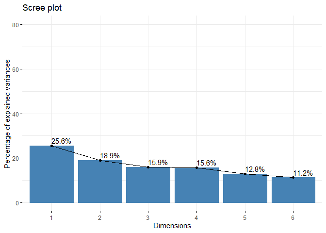
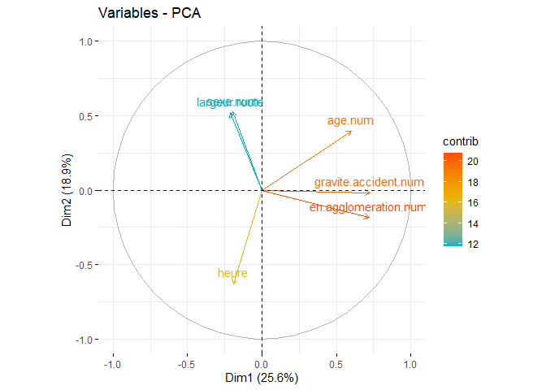
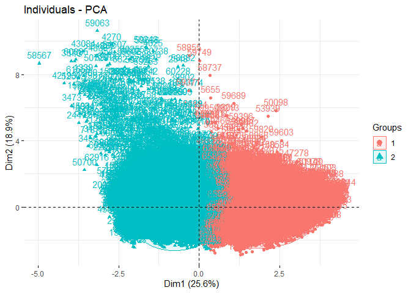

**Accidents de vélo en France (ACP)**

Mots clés : *ACP*, *Bike crash*

Technologie : [R](https://rstudio.com/)

Source de données : [data.gouv.fr](https://www.data.gouv.fr/fr/)

------------------------------------------------------------------------

Les données
-----------

**Importation des données :**

    # chemin du dossier contenant les données
    c <- getwd()
    setwd(c)

    data <- read.csv2("accidents-velos.csv", sep = ",", header = T, encoding = "UTF-8")

Desciption du jeu de données
----------------------------

    head(data) # affichage des 5 premières lignes

    ##   identifiant.accident       date         mois         jour heure departement
    ## 1            2.005e+11 2005-01-13 01 - janvier    3 - jeudi    19          62
    ## 2            2.005e+11 2005-01-19 01 - janvier 2 - mercredi    10          62
    ## 3            2.005e+11 2005-01-26 01 - janvier 2 - mercredi    13          02
    ## 4            2.005e+11 2005-01-03 01 - janvier    0 - lundi    13          02
    ## 5            2.005e+11 2005-01-29 01 - janvier   5 - samedi    18          76
    ## 6            2.005e+11 2005-01-23 01 - janvier 6 - dimanche    18          35
    ##   commune    lat   lon en.agglomeration  type.intersection
    ## 1   62331   50.3  2.84              oui  Hors intersection
    ## 2   62022      0     0              non  Hors intersection
    ## 3   02173      0     0              non Autre intersection
    ## 4   02810 49.255 3.094              oui  Hors intersection
    ## 5   76196      0     0              non  Hors intersection
    ## 6   35207      0     0              oui          Giratoire
    ##                   type.collision                        luminosite
    ## 1   Deux véhicules - par le coté Nuit avec éclairage public allumé
    ## 2      Deux véhicules - frontale                        Plein jour
    ## 3   Deux véhicules - par le coté                        Plein jour
    ## 4      Deux véhicules - frontale                        Plein jour
    ## 5 Deux véhicules - par l’arrière        Nuit sans éclairage public
    ## 6      Deux véhicules - frontale                        Plein jour
    ##   conditions.atmosperiques           type.route circulation nb.voies
    ## 1                  Normale Route Départementale                   NA
    ## 2        Temps éblouissant Route Départementale                   NA
    ## 3                  Normale Route Départementale                    2
    ## 4                  Normale Route Départementale                   NA
    ## 5                  Normale Route Départementale                    2
    ## 6                  Normale Route Départementale                   NA
    ##   profil.long.route   trace.plan.route largeur.TPC largeur.route etat.surface
    ## 1                    Partie rectiligne          NA            50      normale
    ## 2              Plat En courbe à droite          NA            50      normale
    ## 3             Pente  Partie rectiligne          NA            NA      normale
    ## 4              Plat En courbe à gauche          NA            52      normale
    ## 5              Plat  Partie rectiligne          NA            50      normale
    ## 6              Plat                             NA            60      normale
    ##         amenagement    situation categorie.usager       gravite.accident sexe
    ## 1                   Sur chaussée       Conducteur       1 - Blessé léger    M
    ## 2                   Sur chaussée       Conducteur 2 - Blessé hospitalisé    M
    ## 3                   Sur chaussée       Conducteur       1 - Blessé léger    M
    ## 4                   Sur chaussée       Conducteur 2 - Blessé hospitalisé    F
    ## 5                   Sur chaussée       Conducteur       1 - Blessé léger    M
    ## 6 Carrefour aménagé Sur chaussée       Conducteur 2 - Blessé hospitalisé    M
    ##     age           motif.deplacement existence.securite usage.securite
    ## 1 57-58         Promenade - loisirs                                  
    ## 2 19-20         Promenade - loisirs                                  
    ## 3 70-71         Promenade - loisirs             Casque            Non
    ## 4 50-51 Utilisation professionnelle                                  
    ## 5 73-74         Promenade - loisirs              Autre            Oui
    ## 6 45-46         Promenade - loisirs             Casque            Oui
    ##   obstacle.fixe.heurte obstacle.mobile.heurte localisation.choc
    ## 1                                    Véhicule       Côté gauche
    ## 2                                    Véhicule             Avant
    ## 3                                    Véhicule             Avant
    ## 4                                    Véhicule      Avant gauche
    ## 5                                    Véhicule           Arrière
    ## 6                                    Véhicule        Côté droit
    ##       manoeuvre.avant.accident identifiant.vehicule
    ## 1   Changeant de file à gauche      200500000030B02
    ## 2 Sans changement de direction      200500000034B02
    ## 3 Sans changement de direction      200500000078B02
    ## 4         Manœuvre d’évitement      200500000093B02
    ## 5         Même sens, même file      200500000170A01
    ## 6 Sans changement de direction      200500000246B02
    ##                                type.autres.vehicules manoeuvre.autres.vehicules
    ## 1                                Transport en commun         Dépassant à gauche
    ## 2 VU seul 1,5T <= PTAC <= 3,5T avec ou sans remorque          Tournant à gauche
    ## 3                                            VL seul          Tournant à gauche
    ## 4                                            VL seul       Manœuvre d’évitement
    ## 5 VU seul 1,5T <= PTAC <= 3,5T avec ou sans remorque       Même sens, même file
    ## 6                                            VL seul                           
    ##   nombre.autres.vehicules
    ## 1                       1
    ## 2                       1
    ## 3                       1
    ## 4                       1
    ## 5                       1
    ## 6                       1

    str(data) # structure des données

    ## 'data.frame':    65981 obs. of  39 variables:
    ##  $ identifiant.accident      : num  2.01e+11 2.01e+11 2.01e+11 2.01e+11 2.01e+11 ...
    ##  $ date                      : chr  "2005-01-13" "2005-01-19" "2005-01-26" "2005-01-03" ...
    ##  $ mois                      : chr  "01 - janvier" "01 - janvier" "01 - janvier" "01 - janvier" ...
    ##  $ jour                      : chr  "3 - jeudi" "2 - mercredi" "2 - mercredi" "0 - lundi" ...
    ##  $ heure                     : int  19 10 13 13 18 18 16 17 10 15 ...
    ##  $ departement               : chr  "62" "62" "02" "02" ...
    ##  $ commune                   : chr  "62331" "62022" "02173" "02810" ...
    ##  $ lat                       : chr  "50.3" "0" "0" "49.255" ...
    ##  $ lon                       : chr  "2.84" "0" "0" "3.094" ...
    ##  $ en.agglomeration          : chr  "oui" "non" "non" "oui" ...
    ##  $ type.intersection         : chr  "Hors intersection" "Hors intersection" "Autre intersection" "Hors intersection" ...
    ##  $ type.collision            : chr  "Deux véhicules - par le coté" "Deux véhicules - frontale" "Deux véhicules - par le coté" "Deux véhicules - frontale" ...
    ##  $ luminosite                : chr  "Nuit avec éclairage public allumé" "Plein jour" "Plein jour" "Plein jour" ...
    ##  $ conditions.atmosperiques  : chr  "Normale" "Temps éblouissant" "Normale" "Normale" ...
    ##  $ type.route                : chr  "Route Départementale" "Route Départementale" "Route Départementale" "Route Départementale" ...
    ##  $ circulation               : chr  "" "" "" "" ...
    ##  $ nb.voies                  : int  NA NA 2 NA 2 NA NA 2 2 NA ...
    ##  $ profil.long.route         : chr  "" "Plat" "Pente" "Plat" ...
    ##  $ trace.plan.route          : chr  "Partie rectiligne" "En courbe à droite" "Partie rectiligne" "En courbe à gauche" ...
    ##  $ largeur.TPC               : int  NA NA NA NA NA NA NA NA NA NA ...
    ##  $ largeur.route             : int  50 50 NA 52 50 60 NA 60 72 70 ...
    ##  $ etat.surface              : chr  "normale" "normale" "normale" "normale" ...
    ##  $ amenagement               : chr  "" "" "" "" ...
    ##  $ situation                 : chr  "Sur chaussée" "Sur chaussée" "Sur chaussée" "Sur chaussée" ...
    ##  $ categorie.usager          : chr  "Conducteur" "Conducteur" "Conducteur" "Conducteur" ...
    ##  $ gravite.accident          : chr  "1 - Blessé léger" "2 - Blessé hospitalisé" "1 - Blessé léger" "2 - Blessé hospitalisé" ...
    ##  $ sexe                      : chr  "M" "M" "M" "F" ...
    ##  $ age                       : chr  "57-58" "19-20" "70-71" "50-51" ...
    ##  $ motif.deplacement         : chr  "Promenade - loisirs" "Promenade - loisirs" "Promenade - loisirs" "Utilisation professionnelle" ...
    ##  $ existence.securite        : chr  "" "" "Casque" "" ...
    ##  $ usage.securite            : chr  "" "" "Non" "" ...
    ##  $ obstacle.fixe.heurte      : chr  "" "" "" "" ...
    ##  $ obstacle.mobile.heurte    : chr  "Véhicule" "Véhicule" "Véhicule" "Véhicule" ...
    ##  $ localisation.choc         : chr  "Côté gauche" "Avant" "Avant" "Avant gauche" ...
    ##  $ manoeuvre.avant.accident  : chr  "Changeant de file à gauche" "Sans changement de direction" "Sans changement de direction" "Manœuvre d’évitement" ...
    ##  $ identifiant.vehicule      : chr  "200500000030B02" "200500000034B02" "200500000078B02" "200500000093B02" ...
    ##  $ type.autres.vehicules     : chr  "Transport en commun" "VU seul 1,5T <= PTAC <= 3,5T avec ou sans remorque" "VL seul" "VL seul" ...
    ##  $ manoeuvre.autres.vehicules: chr  "Dépassant à gauche" "Tournant à gauche" "Tournant à gauche" "Manœuvre d’évitement" ...
    ##  $ nombre.autres.vehicules   : int  1 1 1 1 1 1 1 1 1 1 ...

    dim(data)[1] # nb lignes

    ## [1] 65981

    dim(data)[2] # nb colonnes

    ## [1] 39

Nettoyage des données
---------------------

Conversion des variables *heure* et *largeur.route* en type numérique

    data$heure <- as.numeric(data$heure)
    data$largeur.route <- as.numeric(data$largeur.route)

J’ajoute une colonne *en.agglomeration.num* qui convertit les modalités
de la variable *en.agglomeration* en numérique

    for (i in 1:dim(data)[1]) {
      if (data$en.agglomeration[i] == "oui") {
        data$en.agglomeration.num[i] <- 1
      }
      else {
        data$en.agglomeration.num[i] <- 2
      }
    }

J’ajoute une colonne *gravite.accident.num* qui convertit les modalités
de la variable *gravite.accident* en numérique

    for (i in 1:dim(data)[1]) {
      if (data$gravite.accident[i] == "0 - Indemne") {
        data$gravite.accident.num[i] <- 0
      }
      else if (data$gravite.accident[i] == "1 - Blessé léger") {
        data$gravite.accident.num[i] <- 1
      }
      else if (data$gravite.accident[i] == "2 - Blessé hospitalisé") {
        data$gravite.accident.num[i] <- 2
      }
      else {
        data$gravite.accident.num[i] <- 3
      }
    }

J’ajoute une colonne *age.num* qui convertit les modalités de la
variable *age* en numérique

    library(tidyverse)

    ## Warning: package 'tidyverse' was built under R version 4.0.5

    ## -- Attaching packages --------------------------------------- tidyverse 1.3.1 --

    ## v ggplot2 3.3.3     v purrr   0.3.4
    ## v tibble  3.1.1     v dplyr   1.0.5
    ## v tidyr   1.1.3     v stringr 1.4.0
    ## v readr   1.4.0     v forcats 0.5.1

    ## Warning: package 'ggplot2' was built under R version 4.0.5

    ## Warning: package 'tibble' was built under R version 4.0.5

    ## Warning: package 'tidyr' was built under R version 4.0.5

    ## Warning: package 'readr' was built under R version 4.0.5

    ## Warning: package 'purrr' was built under R version 4.0.5

    ## Warning: package 'dplyr' was built under R version 4.0.5

    ## Warning: package 'stringr' was built under R version 4.0.5

    ## Warning: package 'forcats' was built under R version 4.0.5

    ## -- Conflicts ------------------------------------------ tidyverse_conflicts() --
    ## x dplyr::filter() masks stats::filter()
    ## x dplyr::lag()    masks stats::lag()

    data$age <- str_sub(data$age, 1,2)
    data$age.num <- as.numeric(data$age)

    ## Warning: NAs introduits lors de la conversion automatique

J’ajoute une colonne *sexe.num* qui convertit les modalités de la
variable *sexe* en binaire (homme=0, femme=1)

    for (i in 1:dim(data)[1]) {
      if (data$sexe[i] == "M") {
        data$sexe.num[i] <- 0
      }
      else {
        data$sexe.num[i] <- 1
      }
    }

Construction de l’ACP
---------------------

Chargement des librairies :

    library(missMDA) # fournit des fonctions de nettoyage de données

    ## Warning: package 'missMDA' was built under R version 4.0.5

    library(FactoMineR) # fournit des fonctions d'ACP avancées

    ## Warning: package 'FactoMineR' was built under R version 4.0.5

    library(factoextra) # fournit des graphiques avancées

    ## Warning: package 'factoextra' was built under R version 4.0.5

Je conserve uniquememnt les variables quantitatives pour évaluer le jeu
de données :

    data.PCA <- data[, c(5,21,40,41,42,43)]

Lancement de l’ACP :

    res.comp <- imputePCA(data.PCA, ncp = 2) # étape préliminaire avant d'effectuer l'ACP pour éliminer les valeurs manquantes
    res.pca <- PCA(res.comp$completeObs, graph = F) # lancement de l'algorithme d'ACP

Choix du **nombre d’axes** à conserver pour l’analyse :

    res.pca$eig # valeurs propres des composantes pricipales

    ##        eigenvalue percentage of variance cumulative percentage of variance
    ## comp 1  1.5349141               25.58190                          25.58190
    ## comp 2  1.1318020               18.86337                          44.44527
    ## comp 3  0.9551658               15.91943                          60.36470
    ## comp 4  0.9355698               15.59283                          75.95753
    ## comp 5  0.7694828               12.82471                          88.78224
    ## comp 6  0.6730655               11.21776                         100.00000

    fviz_eig(res.pca, addlabels = T, ylim = c(0, 80)) # éboulit des valeurs propres

Le **critère de Kaiser** nous amène à conserver les deux premières
composantes principales (valeurs propres &gt; 1 pour une ACP normée).

Avec le **critère coude**, on conserve les deux premiers axes car ils
retiennent 44% de l’inertie totale. Les deux premiers axes représentent
la moitié de la variabilité des données.

De plus, garder le plan principal facilite l’interprétation des
résultats en 2 dimensions.

**Individus :**

    ind.cos2 <- res.pca$ind$cos2 # corrélation des individus sur les nouveaux axes

**Variables :**

    res.pca$var

    ## $coord
    ##                           Dim.1       Dim.2       Dim.3       Dim.4       Dim.5
    ## heure                -0.1920123 -0.62860345  0.42350617  0.53600304  0.31575703
    ## largeur.route        -0.2127619  0.51890753 -0.31980199  0.75830754 -0.08142819
    ## en.agglomeration.num  0.7218695 -0.18331225  0.01726247  0.15032454 -0.33773935
    ## gravite.accident.num  0.7277886 -0.01824164  0.17912567  0.22179607 -0.22080762
    ## age.num               0.6021392  0.39773875  0.04843745 -0.02009211  0.68285212
    ## sexe.num             -0.1985808  0.52465462  0.79925270 -0.03233454 -0.18449613
    ## 
    ## $cor
    ##                           Dim.1       Dim.2       Dim.3       Dim.4       Dim.5
    ## heure                -0.1920123 -0.62860345  0.42350617  0.53600304  0.31575703
    ## largeur.route        -0.2127619  0.51890753 -0.31980199  0.75830754 -0.08142819
    ## en.agglomeration.num  0.7218695 -0.18331225  0.01726247  0.15032454 -0.33773935
    ## gravite.accident.num  0.7277886 -0.01824164  0.17912567  0.22179607 -0.22080762
    ## age.num               0.6021392  0.39773875  0.04843745 -0.02009211  0.68285212
    ## sexe.num             -0.1985808  0.52465462  0.79925270 -0.03233454 -0.18449613
    ## 
    ## $cos2
    ##                           Dim.1        Dim.2        Dim.3        Dim.4
    ## heure                0.03686872 0.3951422973 0.1793574749 0.2872992620
    ## largeur.route        0.04526763 0.2692650198 0.1022733134 0.5750303270
    ## en.agglomeration.num 0.52109553 0.0336033802 0.0002979927 0.0225974679
    ## gravite.accident.num 0.52967627 0.0003327575 0.0320860055 0.0491934959
    ## age.num              0.36257159 0.1581961134 0.0023461861 0.0004036928
    ## sexe.num             0.03943434 0.2752624673 0.6388048721 0.0010455222
    ##                           Dim.5
    ## heure                0.09970250
    ## largeur.route        0.00663055
    ## en.agglomeration.num 0.11406787
    ## gravite.accident.num 0.04875601
    ## age.num              0.46628702
    ## sexe.num             0.03403882
    ## 
    ## $contrib
    ##                          Dim.1       Dim.2       Dim.3       Dim.4      Dim.5
    ## heure                 2.402005 34.91266890 18.77762651 30.70848075 12.9570802
    ## largeur.route         2.949196 23.79082307 10.70738804 61.46311549  0.8616892
    ## en.agglomeration.num 33.949492  2.96901571  0.03119801  2.41536962 14.8239663
    ## gravite.accident.num 34.508529  0.02940068  3.35920779  5.25813228  6.3362050
    ## age.num              23.621621 13.97736604  0.24563128  0.04314941 60.5974615
    ## sexe.num              2.569156 24.32072559 66.87894837  0.11175246  4.4235978

Les variables *en.agglomeration.num*, *gravite.accident.num* et
*age.num* contribuent à la construction du premier axe tandis que
*heure*, *largeur.route* et *sexe.num * contribuent à la construcution
du deuxième axe.

La variable *sexe.num* est égalament bien representée/corrélée sur le
troisième axe.

**Cercle de corrélation** des variables sur le plan principale :

    fviz_pca_var(res.pca, col.var = "contrib",
                            gradient.cols = c("#00AFBB", "#E7B800", "#FC4E07")
    )

On remarque que les variables *en.agglomeration.num* et
*gravite.accident.num* sont très proches et varient dans le même sens.
Donc, le caractère urbain des déplacements à vélo est plus à risque aux
accidents graves. On peut l’expliquer par la densité du traffic et le
manque d’infrastuctures.

La première dimension représente donc les accidents les plus graves.

La variable *age* peut-être mise en relation avec la gravité de
l’accident. Ainsi, une personne plus agée est un sujet plus exposé aux
accidents graves. Ce lien est à nuancer car l’âge a une corrélation de
0.36 avec la dimension 1.

L’heure de la journée où se produit l’accident est indépendante de la
gravité de l’accident.

La largeur de la route et le sexe sont aussi indépendants de la gravité
de l’accident.

**Classification des individus** :

    res.km <- kmeans(res.pca$ind$coord, centers = 2, nstart = 25)
    grp <- as.factor(res.km$cluster)
    fviz_pca_ind(res.pca, col.ind = grp, # coloration par groupes
                 #palette = couleurs,
                 addEllipses = TRUE, # concentration ellipses
                 legend.title = "Groups")

Sur ce graphique, on distingue bien les accidents graves des accidents
plus légers avec une largeur de route plus importante.
