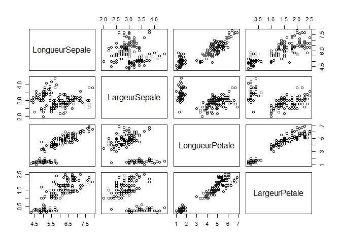
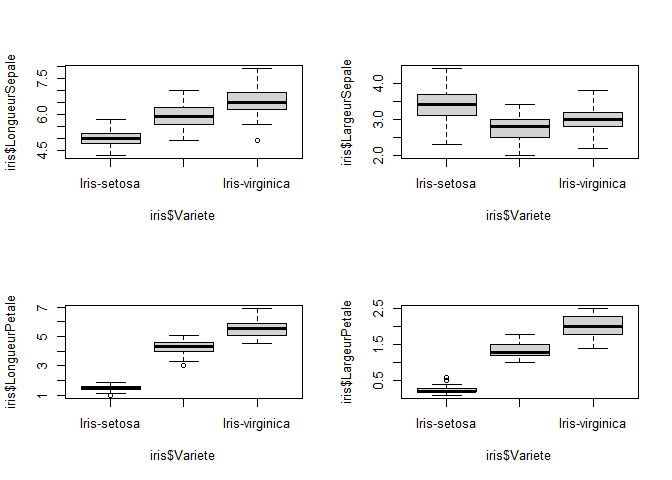
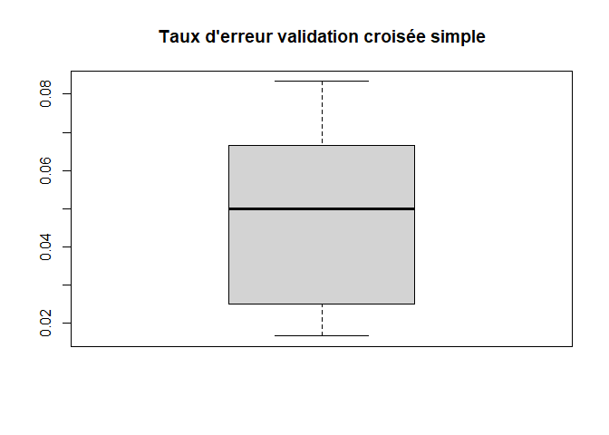
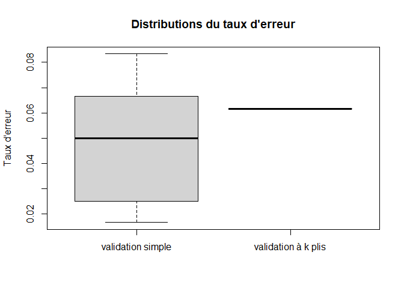
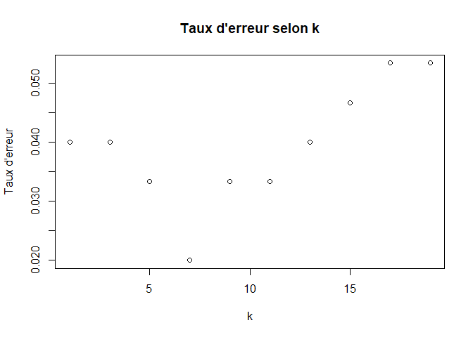

Iris (Data Mining)
==================

Mots clés : *Iris*, *Classification supervisée*, *Data Mining*, *k plus
proches voisins*

Technologie : [R](https://rstudio.com/)

On considère une tâche de classification supervisée qui consiste à
prédire la variété d’iris selon le classifieur de la méthode des k plus
proches voisins.

------------------------------------------------------------------------

Librairies
==========

    library(caret) # fournit des fonctions pour des problèmes de régression et de classification

    ## Warning: package 'caret' was built under R version 4.0.5

    ## Warning: package 'ggplot2' was built under R version 4.0.5

    library(e1071)

    ## Warning: package 'e1071' was built under R version 4.0.5

Jeu de données Iris
===================

Les données
-----------

    c <- getwd() # répertoire local
    setwd(c)
    iris <- read.csv("Iris.csv", sep=",", dec=".",header=T) # lecture dans un dataframe
    nrow(iris) # nombre de lignes

    ## [1] 150

    names(iris) # extraction des noms de colonnes

    ## [1] "LongueurSepale" "LargeurSepale"  "LongueurPetale" "LargeurPetale" 
    ## [5] "Variete"

Il s’agit d’un échantillon de 150 individus décrits selon 5 variables :
*LongueurSepale*, *LargeurSepale*, *LongueurPetale*, *LargeurPetale* et
*Variete*.

    unique(iris$Variete) # identification des modalités de la variable Variete

    ## [1] "Iris-setosa"     "Iris-versicolor" "Iris-virginica"

Convertion de la variable classe en facteur
===========================================

    str(iris)

    ## 'data.frame':    150 obs. of  5 variables:
    ##  $ LongueurSepale: num  5.1 4.9 4.7 4.6 5 5.4 4.6 5 4.4 4.9 ...
    ##  $ LargeurSepale : num  3.5 3 3.2 3.1 3.6 3.9 3.4 3.4 2.9 3.1 ...
    ##  $ LongueurPetale: num  1.4 1.4 1.3 1.5 1.4 1.7 1.4 1.5 1.4 1.5 ...
    ##  $ LargeurPetale : num  0.2 0.2 0.2 0.2 0.2 0.4 0.3 0.2 0.2 0.1 ...
    ##  $ Variete       : chr  "Iris-setosa" "Iris-setosa" "Iris-setosa" "Iris-setosa" ...

    iris$Variete <- as.factor(iris$Variete) # transformation en facteur

Statistique descriptive univariée
---------------------------------

    summary(iris)

    ##  LongueurSepale  LargeurSepale   LongueurPetale  LargeurPetale  
    ##  Min.   :4.300   Min.   :2.000   Min.   :1.000   Min.   :0.100  
    ##  1st Qu.:5.100   1st Qu.:2.800   1st Qu.:1.600   1st Qu.:0.300  
    ##  Median :5.800   Median :3.000   Median :4.350   Median :1.300  
    ##  Mean   :5.843   Mean   :3.054   Mean   :3.759   Mean   :1.199  
    ##  3rd Qu.:6.400   3rd Qu.:3.300   3rd Qu.:5.100   3rd Qu.:1.800  
    ##  Max.   :7.900   Max.   :4.400   Max.   :6.900   Max.   :2.500  
    ##             Variete  
    ##  Iris-setosa    :50  
    ##  Iris-versicolor:50  
    ##  Iris-virginica :50  
    ##                      
    ##                      
    ## 

La variable de classe prend sa valeur dans un ensemble de taille 3 :
{*Iris-setosa*, *Iris-versicolor*, *Iris-virginica*}

Visualisation des données
-------------------------

On affiche les nuages de points pour toutes les combinaisons de deux
variables, et on colore les points selon la variété.

    plot(iris[,-c(5)])

    par(mfrow=c(2,2))
    boxplot(iris$LongueurSepale ~ iris$Variete)
    boxplot(iris$LargeurSepale ~ iris$Variete)
    boxplot(iris$LongueurPetale ~ iris$Variete)
    boxplot(iris$LargeurPetale ~ iris$Variete)

On observe que certaines combinaisons de mesures sont assez
discriminantes. On peut espérer mettre au point un classifieur efficace.

Classification supervisée
-------------------------

**Méthode des k plus proches voisins**

### Définition du problème

On tente de résoudre une tâche de classification supervisée à partir
d’un échantillon constitué de 4 variables pour préédire la variété
(variable label).

### Validation croisée simple pour k=1

    # boucle sur 20 échantillons aléatoires et calcule du taux d'erreur
    set.seed(0) # définition de la graine utilisée pour les tirages aléatoires à 0 (permet de reproduire les résultats)
    taux_simple <- numeric(20)
    for(i in c(1:20)) {
      index <- createDataPartition(iris$Variete, p=0.6, list=FALSE) # tirage aléatoire de 60% des individus
      X_train <- iris[index, 1:4] # échantillon d'entraînement pour entraîner le modèle
      Y_train <- iris[index, 5]
      X_test <- iris[-index, 1:4] # échantillon de test pour évaluer le modèle
      Y_test <- iris[-index, 5]
      modele <- train(x=X_train, y=Y_train, method="knn", tuneGrid=data.frame(k=1)) # entraînement du modèle sur train pour k=1
      pred <- predict(object=modele, X_test) # prédiction de la variété sur test
      M <- confusionMatrix(pred, Y_test) # matrice de confusion
      taux_simple[i] <- 1 - sum(diag(M$table)) / sum(M$table) # taux d'erreur global
    }
    summary(modele)

    ##             Length Class      Mode     
    ## learn       2      -none-     list     
    ## k           1      -none-     numeric  
    ## theDots     0      -none-     list     
    ## xNames      4      -none-     character
    ## problemType 1      -none-     character
    ## tuneValue   1      data.frame list     
    ## obsLevels   3      -none-     character
    ## param       0      -none-     list

    summary(taux_simple) # statistiques dispersion taux erreur global par validation croisé simple

    ##    Min. 1st Qu.  Median    Mean 3rd Qu.    Max. 
    ## 0.01667 0.02917 0.05000 0.04667 0.06667 0.08333

    boxplot(taux_simple, main="Taux d'erreur validation croisée simple")

Validation croisée à k plis
---------------------------

    # Validation croisée à k plis
    set.seed(0)
    plis <- createFolds(iris$Variete, 5, returnTrain=TRUE) # pliage de l'échantillon en 5
    M.total <- matrix(0, nrow=3, ncol=3) # création d'une matrice nulle 3 x 3 (car la variable de classe a 3 modalités)
    for(index in plis){
      X_train <- iris[index, 1:4] # échantillon d'entraînement pour entraîner le modèle
      Y_train <- iris[index, 5]
      X_test <- iris[-index, 1:4] # échantillon de test pour évaluer le modèle
      Y_test <- iris[-index, 5]
      modele <- train(x=X_train, y=Y_train, method="knn", tuneGrid=data.frame(k=1)) # entraînement du modèle sur train
      pred <- predict(object=modele, X_test) # prédiction de la variété
      M <- confusionMatrix(pred, Y_test)
      M.total <- M.total + M$table
    }
    1 - sum(diag(M.total)) / sum(M.total)

    ## [1] 0.04

Par cette procédure on estime le taux d’erreur global à 4%.

Comparaison des deux procédures de validation croisée
-----------------------------------------------------

On répète 20 fois la procédure de validation croisée à k plis pour
mesurer la dispersion du taux d’erreur et la comparer à celle mesurée en
validation croisée simple.

    set.seed(0)
    plis <- createFolds(iris$Variete, 5) # 5 plis
    M.total <- matrix(0, nrow=3, ncol=3) # matrice nulle 3x3
    taux_plis <- numeric(20)
    for(i in c(1:20)){
      for(index in plis){
        X_train <- iris[index, 1:4] # échantillon d'entraînement pour entraîner le modèle
        Y_train <- iris[index, 5]
        X_test <- iris[-index, 1:4] # échantillon de test pour évaluer le modèle
        Y_test <- iris[-index, 5]
        modele <- train(x=X_train, y=Y_train, method="knn", tuneGrid=data.frame(k=1)) # entraînement
        pred <- predict(object=modele, X_test) # prédiction
        M <- confusionMatrix(pred, Y_test)
        M.total <- M.total + M$table # ajout des matrices de confusion des plis
      }
      taux_plis[i] <- 1 - sum(diag(M.total)) / sum(M.total) # taux d’erreur global
    }
    summary(taux_plis)

    ##    Min. 1st Qu.  Median    Mean 3rd Qu.    Max. 
    ## 0.06167 0.06167 0.06167 0.06167 0.06167 0.06167

    boxplot(list(taux_simple, taux_plis), main="Distributions du taux d'erreur", names=c("validation simple", "validation à k plis"), ylab="Taux d'erreur")

Recherche de la taille de voisinage optimale
============================================

    # Validation croisée à k plis
    set.seed(0)
    plis <- createFolds(iris$Variete, 5, returnTrain=TRUE)
    taux <- numeric(10)
    i <- 1
    for(k in c(1, 3, 5, 7, 9, 11, 13, 15, 17, 19)){
      M.total <- matrix(0, nrow=3, ncol=3)
      for(index in plis){
        X_train <- iris[index, 1:4] # échantillon d'entraînement pour entraîner le modèle
        Y_train <- iris[index, 5]
        X_test <- iris[-index, 1:4] # échantillon de test pour évaluer le modèle
        Y_test <- iris[-index, 5]
        modele <- train(x=X_train, y=Y_train, method="knn", tuneGrid=data.frame(k=k)) # entraînement du modèle sur D.0
        pred <- predict(object=modele, X_test) # prédiction de la variété
        M <- confusionMatrix(pred, Y_test)
        M.total <- M.total + M$table
      }
      taux[i] <- 1 - sum(diag(M.total)) / sum(M.total)
      i <- i + 1
    }
    plot(c(1, 3, 5, 7, 9, 11, 13, 15, 17, 19), taux, main="Taux d'erreur selon k", xlab="k", ylab="Taux d'erreur")

Conclusion
----------

Le taux d’erreur varie entre 2% et un peu plus de 5%. Ce sont des taux
somme toute bas et proches, la taille du voisinnage ne semble donc ici
n’avoir que peu d’effet sur la performance. Si on devait intérgrer ce
classifieur dans une application réelle, on choisirait probablement
**k=7**, d’après cette validation croisée à 5 plis.
