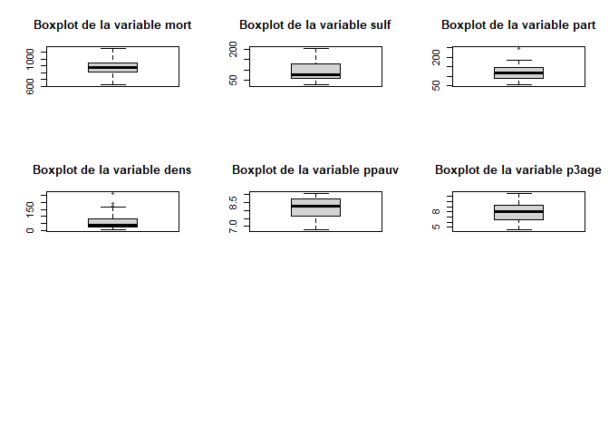
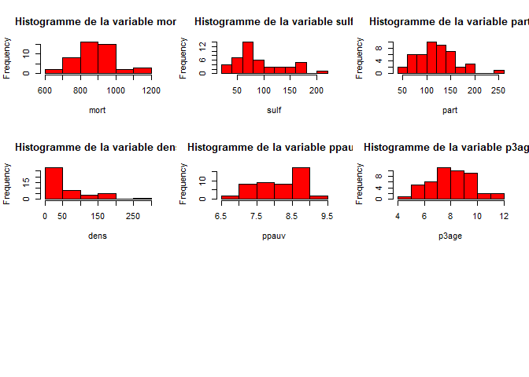
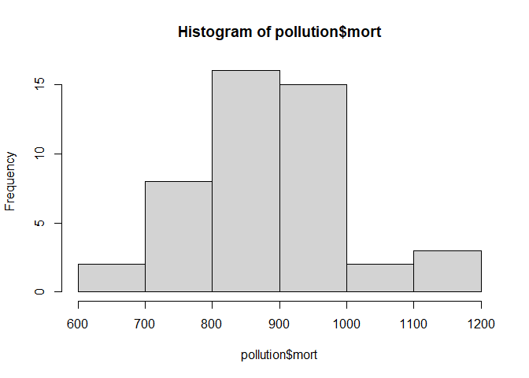
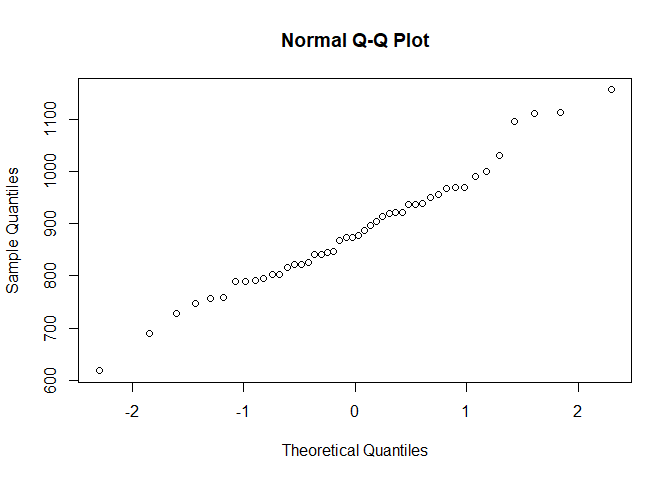
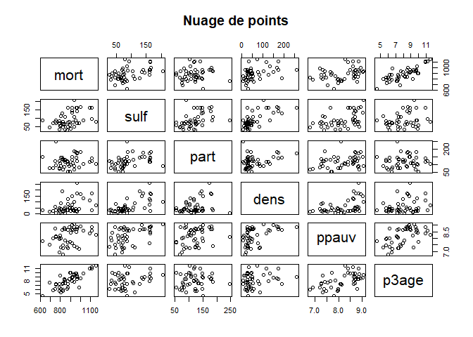
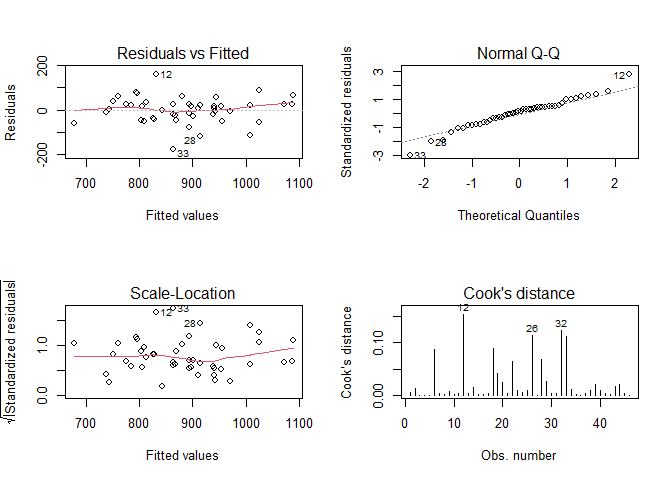

**Pollution et mortalité (Régression)**

Mots clés : *Régression*, *Modèle linéaire*, *Pollution*

Technologie : [R](https://rstudio.com/)

L’objectif de cette étude est de comprendre les causes de la mortalité
du à la pollution.

Les informations du jeu de données pollution sont mesurées sur plusieurs
villes des Etats-Unis.

Pour expliquer la mortalité dans ces villes, je vais réaliser une
régression linéaire multiple pour expliquer la variable mort. Ainsi, on
pourra comprendre quelles sont les causes de la mortalité.

------------------------------------------------------------------------

Librairies
==========

    library(plotly) # graphiques jolies

    ## Warning: package 'plotly' was built under R version 4.0.5

    ## Warning: package 'ggplot2' was built under R version 4.0.5

    library(car) # fonction pour mesurer la colinéarité entre les variables du modèles

    ## Warning: package 'car' was built under R version 4.0.5

    ## Warning: package 'carData' was built under R version 4.0.3

Jeu de données pollution
========================

Les données
-----------

    c <- getwd() # répertoire local
    setwd(c)
    pollution <- read.csv2("pollution.csv", sep = " ", dec = ".", header = TRUE) # chargement des données
    pollution$ppauv <- pollution$ppauv/10
    pollution$p3age <- pollution$p3age/10

Analyse descriptive univariée
-----------------------------

**Statistiques descriptives**

    head(pollution) # afichage des 5 premières lignes

    ##   num code      ville mort sulf part  dens ppauv p3age
    ## 1   1 PROV Providence 1096  163  119 116.1  8.39  10.9
    ## 2   2 JACK    Jackson  789   70   74  21.3  6.91   6.4
    ## 3   3 HUNT Huntington  967   70  122  18.1  7.32   9.3
    ## 4   4 DESM Des_Moines  950   88  183  44.8  8.71   9.7
    ## 5   5 DENV     Denver  841   61  126  25.4  8.69   8.2
    ## 6   6 READ    Reading 1113   94  120  31.9  8.61  11.2

    str(pollution) # format des variables

    ## 'data.frame':    46 obs. of  9 variables:
    ##  $ num  : int  1 2 3 4 5 6 7 8 9 10 ...
    ##  $ code : chr  "PROV" "JACK" "HUNT" "DESM" ...
    ##  $ ville: chr  "Providence" "Jackson" "Huntington" "Des_Moines" ...
    ##  $ mort : int  1096 789 967 950 841 1113 1031 845 873 957 ...
    ##  $ sulf : int  163 70 70 88 61 94 86 34 48 162 ...
    ##  $ part : int  119 74 122 183 126 120 104 119 102 147 ...
    ##  $ dens : num  116.1 21.3 18.1 44.8 25.4 ...
    ##  $ ppauv: num  8.39 6.91 7.32 8.71 8.69 8.61 8.61 7.85 7.25 8.48 ...
    ##  $ p3age: num  10.9 6.4 9.3 9.7 8.2 11.2 9.8 8.1 7.3 9.7 ...

    summary(pollution) # statistiques descriptives

    ##       num            code              ville                mort       
    ##  Min.   : 1.00   Length:46          Length:46          Min.   : 618.0  
    ##  1st Qu.:12.25   Class :character   Class :character   1st Qu.: 806.5  
    ##  Median :23.50   Mode  :character   Mode  :character   Median : 875.0  
    ##  Mean   :23.50                                         Mean   : 885.1  
    ##  3rd Qu.:34.75                                         3rd Qu.: 947.5  
    ##  Max.   :46.00                                         Max.   :1157.0  
    ##       sulf             part             dens            ppauv      
    ##  Min.   : 27.00   Min.   : 54.00   Min.   :  6.10   Min.   :6.780  
    ##  1st Qu.: 62.25   1st Qu.: 90.25   1st Qu.: 25.98   1st Qu.:7.657  
    ##  Median : 78.00   Median :119.50   Median : 41.50   Median :8.265  
    ##  Mean   : 91.78   Mean   :119.76   Mean   : 63.46   Mean   :8.158  
    ##  3rd Qu.:124.00   3rd Qu.:144.75   3rd Qu.: 81.40   3rd Qu.:8.710  
    ##  Max.   :205.00   Max.   :247.00   Max.   :261.10   Max.   :9.070  
    ##      p3age       
    ##  Min.   : 4.500  
    ##  1st Qu.: 6.650  
    ##  Median : 8.000  
    ##  Mean   : 8.043  
    ##  3rd Qu.: 9.275  
    ##  Max.   :11.600

    dim(pollution)[2] # nombre de colonnes

    ## [1] 9

    colnames(pollution) # noms des colonnes

    ## [1] "num"   "code"  "ville" "mort"  "sulf"  "part"  "dens"  "ppauv" "p3age"

**Représentation des données**

    par(mfrow=c(3,3))
    for(i in 4:9) {
      boxplot(pollution[,i], main = paste("Boxplot de la variable", colnames(pollution)[i]))
    }

    par(mfrow=c(3,3))
    for(i in 4:9) {
      hist(pollution[,i], main = paste("Histogramme de la variable", colnames(pollution)[i]), xlab = paste(colnames(pollution)[i]), col = 'red')
    }

Normalité de y
--------------

On test la normalité de la variable réponse *mort*

**Hypothèses** :

H0 : les données suivent une loi normale

H1 : les données ne suivent pas une loi normale

    p_valeur <- round(shapiro.test(pollution$mort)$p.value, 3) # test de Shapiro
    hist(pollution$mort) # bien répartie autour de la moyenne

    qqnorm(pollution$mort) # points sont alignés

On obtient une p-valeur égale à 0.657 &gt; 0.05

Elle est très supérieure à 0.05 donc on peut rejetter H1 au profit de H0

On n’a pas beaucoup de chance de se tromper sur la normalité de la
variable *mort*

Analyse descriptive multivariée
-------------------------------

    tapply(pollution[,4], pollution$ville, mean) # mortalité en fonction des villes

    ##      Augusta       Austin     Beaumont       Boston   Bridgeport    Charlotte 
    ##          823          689          728         1112          938          791 
    ##  Chattanooga      Chicago    Cleveland     Columbus       Dallas       Dayton 
    ##          940         1000          969          877          757          847 
    ##       Denver   Des_Moines      Detroit      El_Paso   Fall_River        Flint 
    ##          841          950          817          618         1157          747 
    ##   Fort_Worth       Fresno    Galveston   Huntington Indianapolis      Jackson 
    ##          789          845          873          967          969          789 
    ##    Knoxville        Macon      Memphis        Miami    Milwaukee       Mobile 
    ##          825          869          873          897          921          823 
    ##    Nashville      Norfolk        Omaha      Phoenix   Providence      Reading 
    ##          919          803          922          758         1096         1113 
    ##     Rockford     Savannah      Seattle  Sioux_Falls   South_Bend       Toledo 
    ##          842          990          938          795          888         1031 
    ##       Topeka      Winston         York   Youngstown 
    ##          904          802          957          915

    #plot_ly(
    #  x = pollution$ville,
    #  y = pollution$mort,
    #  type = "bar",
    #  color = pollution$mort
    #  ) %>% layout(title = "Diagramme en barre de la mortalité en fonction des villes",
    #         xaxis = list(title = "ville"),
    #         yaxis = list(title = "mort"))

Fall River a le plus grand nombre de mort à cause de la pollution avec
1157 morts.

**Corrélation entre deux variables**

    cor(pollution[,4:9]) # coefficients de corrélation entre les variables quantitatives

    ##            mort      sulf       part      dens     ppauv      p3age
    ## mort  1.0000000 0.4203033 0.10435195 0.4126954 0.3411812 0.79754775
    ## sulf  0.4203033 1.0000000 0.42122573 0.6803931 0.4807265 0.30425887
    ## part  0.1043520 0.4212257 1.00000000 0.3131133 0.2842739 0.06293669
    ## dens  0.4126954 0.6803931 0.31311334 1.0000000 0.4812894 0.25547141
    ## ppauv 0.3411812 0.4807265 0.28427387 0.4812894 1.0000000 0.54125978
    ## p3age 0.7975477 0.3042589 0.06293669 0.2554714 0.5412598 1.00000000

Forte corrélation (très significative) avec *p3age*

    plot(pollution[,4:9], main = "Nuage de points")

Régression linéaire multiple pour expliquer mort
------------------------------------------------

**Modèle complet**

    modlinXY <- lm(pollution$mort ~ pollution$sulf + pollution$part + pollution$dens + pollution$ppauv + pollution$p3age)

**Résultat et interprétation du modèle**

    summary(modlinXY)

    ## 
    ## Call:
    ## lm(formula = pollution$mort ~ pollution$sulf + pollution$part + 
    ##     pollution$dens + pollution$ppauv + pollution$p3age)
    ## 
    ## Residuals:
    ##     Min      1Q  Median      3Q     Max 
    ## -168.72  -32.40    2.10   33.26  158.49 
    ## 
    ## Coefficients:
    ##                   Estimate Std. Error t value Pr(>|t|)    
    ## (Intercept)     806.972781 129.973116   6.209  2.4e-07 ***
    ## pollution$sulf    0.351191   0.300177   1.170  0.24895    
    ## pollution$part    0.007978   0.258356   0.031  0.97552    
    ## pollution$dens    0.480399   0.219996   2.184  0.03491 *  
    ## pollution$ppauv -54.689537  19.080375  -2.866  0.00659 ** 
    ## pollution$p3age  57.261997   6.457879   8.867  5.5e-11 ***
    ## ---
    ## Signif. codes:  0 '***' 0.001 '**' 0.01 '*' 0.05 '.' 0.1 ' ' 1
    ## 
    ## Residual standard error: 60.79 on 40 degrees of freedom
    ## Multiple R-squared:  0.7407, Adjusted R-squared:  0.7083 
    ## F-statistic: 22.85 on 5 and 40 DF,  p-value: 9.106e-11

La variable *sulf* et *part* n’apportent rien au modèle car la p-valeur
de la statistique de Student (nullité du coefficient) est élevée. Donc
La mortalité ne dépend pas de *sulf* et *part*.

De plus, la variable *p3age* est significative (p-valeur faible).

Le R2 ajusté est de 0.71 donc 71% de la variabilité de la mortalité est
expliquée par ces variables exogènes.

La p-valeur est inférieur à 0.05 donc le modèle est significatif.

Sélection de variables
----------------------

**Démarche pas-à-pas**

**Sélection descendante**

    step(modlinXY, direction = c("backward"))

    ## Start:  AIC=383.45
    ## pollution$mort ~ pollution$sulf + pollution$part + pollution$dens + 
    ##     pollution$ppauv + pollution$p3age
    ## 
    ##                   Df Sum of Sq    RSS    AIC
    ## - pollution$part   1         4 147803 381.45
    ## - pollution$sulf   1      5058 152857 383.00
    ## <none>                         147799 383.45
    ## - pollution$dens   1     17619 165419 386.63
    ## - pollution$ppauv  1     30356 178155 390.04
    ## - pollution$p3age  1    290513 438312 431.45
    ## 
    ## Step:  AIC=381.45
    ## pollution$mort ~ pollution$sulf + pollution$dens + pollution$ppauv + 
    ##     pollution$p3age
    ## 
    ##                   Df Sum of Sq    RSS    AIC
    ## - pollution$sulf   1      5583 153386 381.16
    ## <none>                         147803 381.45
    ## - pollution$dens   1     17625 165428 384.63
    ## - pollution$ppauv  1     30967 178770 388.20
    ## - pollution$p3age  1    296116 443918 430.04
    ## 
    ## Step:  AIC=381.16
    ## pollution$mort ~ pollution$dens + pollution$ppauv + pollution$p3age
    ## 
    ##                   Df Sum of Sq    RSS    AIC
    ## <none>                         153386 381.16
    ## - pollution$ppauv  1     27408 180794 386.72
    ## - pollution$dens   1     47426 200812 391.55
    ## - pollution$p3age  1    304415 457801 429.46

    ## 
    ## Call:
    ## lm(formula = pollution$mort ~ pollution$dens + pollution$ppauv + 
    ##     pollution$p3age)
    ## 
    ## Coefficients:
    ##     (Intercept)   pollution$dens  pollution$ppauv  pollution$p3age  
    ##        791.9591           0.6388         -50.5942          57.8511

La méthode descendante conserve 3 variables pour expliquer la mortalité
:

-   *ppauv*
-   *dens*
-   *p3age*

Le modèle ne conserve pas la *pollution* car cette variable est corrélé
avec la *densité*.

*ppauv* est inversement corrélée à la *mortalité*.

L’AIC diminuent entre les modèles.

**Modèle sélectionné**

    modlinXY <- lm(pollution$mort ~ pollution$dens + pollution$ppauv + pollution$p3age)
    summary(modlinXY)

    ## 
    ## Call:
    ## lm(formula = pollution$mort ~ pollution$dens + pollution$ppauv + 
    ##     pollution$p3age)
    ## 
    ## Residuals:
    ##      Min       1Q   Median       3Q      Max 
    ## -175.511  -34.857    9.014   26.728  159.009 
    ## 
    ## Coefficients:
    ##                 Estimate Std. Error t value Pr(>|t|)    
    ## (Intercept)     791.9591   128.4522   6.165 2.30e-07 ***
    ## pollution$dens    0.6388     0.1773   3.604 0.000825 ***
    ## pollution$ppauv -50.5942    18.4685  -2.739 0.008993 ** 
    ## pollution$p3age  57.8511     6.3365   9.130 1.58e-11 ***
    ## ---
    ## Signif. codes:  0 '***' 0.001 '**' 0.01 '*' 0.05 '.' 0.1 ' ' 1
    ## 
    ## Residual standard error: 60.43 on 42 degrees of freedom
    ## Multiple R-squared:  0.7309, Adjusted R-squared:  0.7117 
    ## F-statistic: 38.02 on 3 and 42 DF,  p-value: 4.849e-12

Le modèle réduit est plus significatif que le modèle complet.

Le R2 a augmenté, il est désormais de 0.73

Lorsque l’on augmente la densité de la population de 1 unité, la
mortalité augmente de 0.6 mort

**Equation du modèle** : y = 792 + 0.64 \* dens -51 \* ppauv + 58 \*
p3age

Validation du modèle
--------------------

    par(mfrow=c(2,2))
    plot(modlinXY, 1) # résidus (bruts) en fonction des valeurs prédites
    plot(modlinXY, 2) # permet de vérifer l'hypothèse de normalité des résidus (pointillés sont les résidus théoriques N(0, sigma²)) 
    plot(modlinXY, 3) # racine carrée des résidus studentisés (en valeur absolue) en fonction des valeurs prédites pour vérifer que la variance est constante
    plot(modlinXY, 4) # points trop "infuents" caractérisés par de grandes valeurs du D de Cook. Pour considérer un point comme aberrant et le supprimer, il faut que sa distance de Cook soit très importante par rapport aux autres valeurs.

Le nuage de points est sans structure particulière (homogène compris
entre -2 et 2).

Ici, les résidus sont répartis de manière parfaite (alignés sur la
droite de régression).

Sur le graphique des valeurs de Cook, il n’y a pas de points abhérants.

**Je vérifie l’absence de multicolinéarité**

    vif(modlinXY)

    ##  pollution$dens pollution$ppauv pollution$p3age 
    ##        1.301533        1.720683        1.414417

Une valeur de VIF (facteur d’infation de la variance) qui tend vers 1
signife une absence de multicolinéarité entre les variables
explicatives. En revanche, si elle est supérieure à 5, alors on détecte
un problème de multicolinéarité entre les variables explicatives.

Conclusion
----------

Pour conclure, la mortalité causée par la pollution dépend de la
**pauvreté**, la **densité** et l’**âge** de la population.
