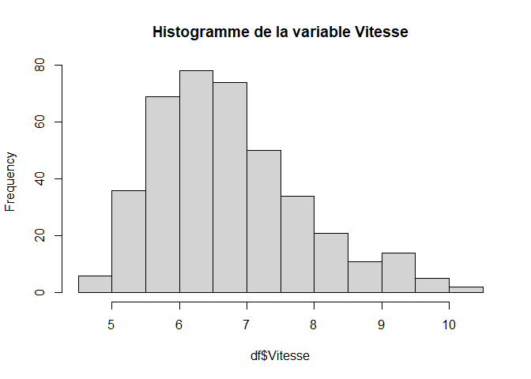
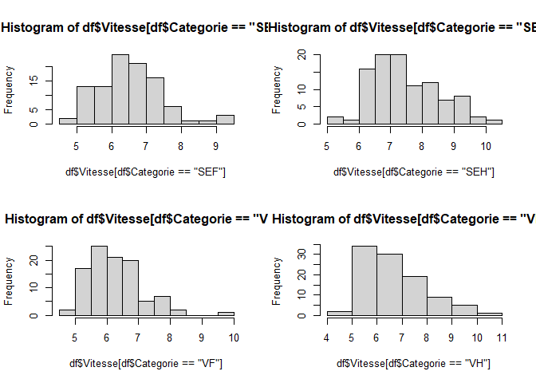
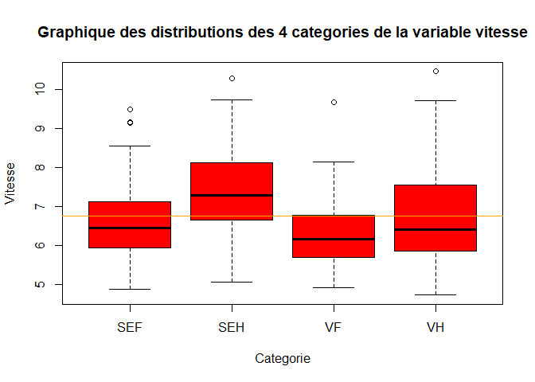
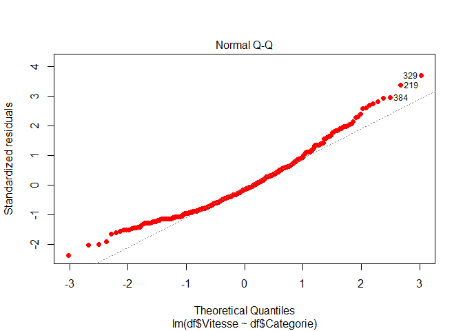
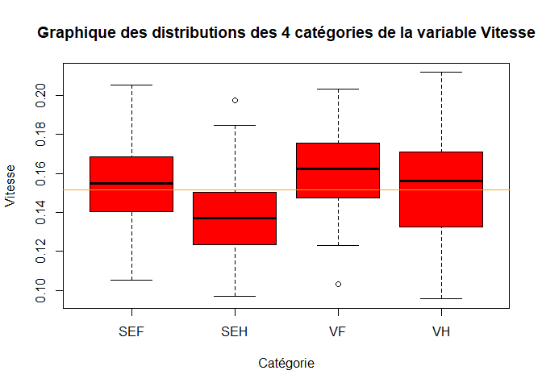
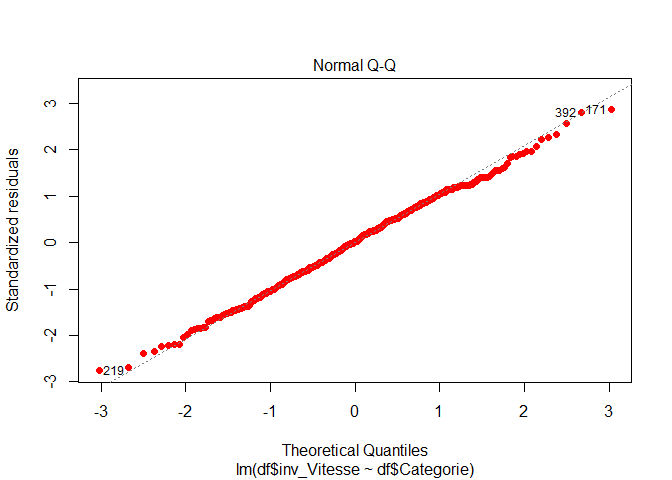
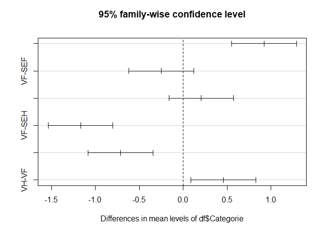

**SaintéLyon (Anova)**

Mots clés : *Trail*, *SaintéLyon*, *Modélisation*, *Anova*

Technologie : [R](https://rstudio.com/)

L’objectif est de voir s’il existe une différence significative de
vitesse entre les catégories lors de la SaintéLyon. Si oui, repérer
statistiquement ses différences entre les différentes catégories de
coureurs.

------------------------------------------------------------------------

Librairies
==========

    library(plotly) # visualisations intéractives

    ## Warning: package 'plotly' was built under R version 4.0.5

    ## Warning: package 'ggplot2' was built under R version 4.0.5

    library(knitr)

    ## Warning: package 'knitr' was built under R version 4.0.5

Données
=======

Chargement des données
----------------------

On charge les données à partir d’un fichier CSV :

    df <- read.csv2("SaintéLyon.csv", header = T) # lecture dans un dataframe
    nrow(df) # calcul du nombre de lignes

    ## [1] 400

    names(df) # extraction des noms des colonnes

    ## [1] "Vitesse"   "Categorie"

    head(df) #  affichage des 5 premières lignes

    ##   Vitesse Categorie
    ## 1    7.66       SEF
    ## 2    6.39       SEF
    ## 3    5.80       SEF
    ## 4    6.83       SEF
    ## 5    6.32       SEF
    ## 6    6.62       SEF

Il s’agit d’un échantillon de 400 individus décrits selon 2 variables :
*Vitesse* et *Categorie*.

Contexte statistique
--------------------

    unique(df$Categorie) # identification des modalités de la variable Categorie

    ## [1] "SEF" "SEH" "VF"  "VH"

    summary(df) # statistique descriptive

    ##     Vitesse        Categorie        
    ##  Min.   : 4.720   Length:400        
    ##  1st Qu.: 5.957   Class :character  
    ##  Median : 6.600   Mode  :character  
    ##  Mean   : 6.755                     
    ##  3rd Qu.: 7.350                     
    ##  Max.   :10.470

    var(df$Vitesse) # variance

    ## [1] 1.206672

    sd(df$Vitesse) # ecart-type

    ## [1] 1.098486

    tapply(df$Vitesse, df$Categorie, summary) # moyenne, min et max de la vitesse selon les catégories

    ## $SEF
    ##    Min. 1st Qu.  Median    Mean 3rd Qu.    Max. 
    ##   4.870   5.938   6.455   6.537   7.120   9.500 
    ## 
    ## $SEH
    ##    Min. 1st Qu.  Median    Mean 3rd Qu.    Max. 
    ##   5.060   6.660   7.285   7.456   8.113  10.300 
    ## 
    ## $VF
    ##    Min. 1st Qu.  Median    Mean 3rd Qu.    Max. 
    ##   4.920   5.695   6.155   6.286   6.763   9.690 
    ## 
    ## $VH
    ##    Min. 1st Qu.  Median    Mean 3rd Qu.    Max. 
    ##   4.720   5.850   6.405   6.742   7.508  10.470

    # différentes vitesses entre les catégories
    tapply(df$Vitesse, df$Categorie, var) #variance pour chaque categorie sur la variable vitesse

    ##       SEF       SEH        VF        VH 
    ## 0.8317762 1.1459859 0.7265331 1.3921422

    # différentes variances entre les catégories

Le jeu de données a 4 modalités pour la variable *Categorie*. La
catégorie SEH détient la plus grande vitesse moyenne.

Visualisation des données
-------------------------

    hist(df$Vitesse, main = "Histogramme de la variable Vitesse")

La distribution de la vitesse semble avoir une forme de loi Normale. On
peut vérifier cette hypothèse à l’aide d’un test de Shapiro.

**Hypotheses ** : - H0 : les données suivent une loi normale - H1 : les
données ne suivent pas une loi normale

    shapiro.test(df$Vitesse)$p.value

    ## [1] 1.368111e-09

La p-valeur est très inférieur à 0.05 donc on rejette H0 au profit de
H1. Les données ne sont pas normalement distribuées.

On peut vérifier la normalité pour chaque modalités :

    shapiro.test(df$Vitesse[df$Categorie == "SEF"])$p.value

    ## [1] 0.008018432

    shapiro.test(df$Vitesse[df$Categorie == "SEH"])$p.value

    ## [1] 0.01042897

    shapiro.test(df$Vitesse[df$Categorie == "VF"])$p.value

    ## [1] 0.0002470281

    shapiro.test(df$Vitesse[df$Categorie == "VH"])$p.value

    ## [1] 5.981829e-05

    par(mfrow = c(2, 2)) # division de la fenêtre en 2 lignes et 2 colonnes
    hist(df$Vitesse[df$Categorie == "SEF"])
    hist(df$Vitesse[df$Categorie == "SEH"])
    hist(df$Vitesse[df$Categorie == "VF"])
    hist(df$Vitesse[df$Categorie == "VH"])

Les distributions marginales pour chacune des modalités de *Categorie*
violent l’hypothèse Gaussienne (p-valeur &lt; 0.05). Dans le contexte
d’une Anova et étant donné sa robustesse à l’hypothèse gaussienne, on
peut raisonnablement mener l’analyse.

    # représentation des distributions des 4 catégories avec plotly
    #graph <- plot_ly(x = df$Categorie, y = df$Vitesse,
    #        type = "box")
    #graph <- graph %>% layout(title = "Graphique de la distribution de la vitesse par catégorie",
    #                          xaxis = list(title = "Catégorie"),
    #                          yaxis = list(title = "Vitesse [km/h]"))
    #graph
    boxplot(df$Vitesse ~ df$Categorie,
            main="Graphique des distributions des 4 categories de la variable vitesse", 
            xlab = "Categorie", 
            ylab = "Vitesse", 
            col = "red")
    abline(h=mean(df$Vitesse), col = "orange")

On remarque une différence de vitesse entre les catégories.

La vitesse des seniors hommes semble plus élevée que les autres tandis
que la moyenne la plus basse concerne les vétérans femmes.

On observe aussi une grande dispersion de la vitesse chez les hommes,
donc la vitesse d’un coureur varie en fonction de la catégorie.

Une variable qualitative (*Categorie*) a une action sur une variable
quantitatve (*Vitesse*).

Il semblerait qu’il existe une différence de vitesse entre les
catégories

On vérifie cette hypothèse à l’aide d’un test de l’Anova.

    table(df$Categorie)

    ## 
    ## SEF SEH  VF  VH 
    ## 100 100 100 100

Il s’agit d’un **plan complet et équilibré** car toutes les modalités
ont été testées et il y a le même nombre de cas dans les modalités.

Test de l’Anova (=analyse de variance à un facteur)
===================================================

Construction du modèle et hypothèses
------------------------------------

Existe-t-il une différence de vitesse entre les catégories ?

**Hypothèse** : - H0 : pas de différence de moyenne entre chaque
categorie (suivant vitesse) - H1 : il y a une influence sur la vitesse
en fonction de la categorie

    modele <- lm(df$Vitesse ~ df$Categorie)

Validité du modèle
------------------

Trois conditions à respecter pour les e(ij) : - normalité : e(ij)
suivent une loi normale centrée (moyenne = 0) - indépendance :
covariance nulle - homoscédasticité : les e(ij) ont toutes les mêmes
variances

### Test de l’hypothèse de normalité des résidus

    shapiro.test(residuals(modele))$p.value # test de Shapiro

    ## [1] 1.066805e-08

p-valeur &lt; 0.05 donc on conserve H1, les résidus ne sont pas
distribués selon une loi normale.

Test de l’hypothèse de normalité des résidus graphiquement (QQ-plot)

    plot(modele, 2, col="red", pch =16)

Les points ne sont pas alignés sur la droite donc on rejette H0 (les
résidus ne suivent pas une loi normale).

On ne réalise pas le test de Bartlett (égalité des variances) car le
test de Shapiro n’est pas respecté.

Donc on ne peut pas appliquer le test de l’Anova car les conditions ne
sont pas respectées.

Transformation des données
--------------------------

    df$inv_Vitesse <- 1/df$Vitesse # transformation sur les données (avec l'inverse)

    # représentation des distributions des trois catégories (avec le log)
    boxplot(df$inv_Vitesse ~ df$Categorie, 
            main="Graphique des distributions des 4 catégories de la variable Vitesse", 
            xlab = "Catégorie",
            ylab = "Vitesse",
            col = "red")
    abline(h=mean(df$inv_Vitesse), col = "orange")

Construction et validation du nouveau modèle
--------------------------------------------

    modele2 <- lm(df$inv_Vitesse ~ df$Categorie)

On vérifie les conditions avec le nouveau modèle2 :

### Test de l’hypothèse de normalité des résidus

    # test de l'hypothèse de normalité des résidus
    shapiro.test(residuals(modele2)) #  test de Shapiro

    ## 
    ##  Shapiro-Wilk normality test
    ## 
    ## data:  residuals(modele2)
    ## W = 0.99701, p-value = 0.6783

p-valeur &gt; 0.05 donc on ne peut pas rejetter H0, les résidus sont
distribués selon une loi normale.

Test de l’hypothèse de normalité des résidus graphiquement (QQ-plot)

    plot(modele2, 2, col="red", pch =16)

Les points sont alignés sur la droite donc on rejette H1, les résidus
suivent la loi normale.

### Test de l’homoscédasticité à l’aide d’un test de Barlett (variance des résidus)

    bartlett.test(residuals(modele2)~df$Categorie) #test de Bartlett

    ## 
    ##  Bartlett test of homogeneity of variances
    ## 
    ## data:  residuals(modele2) by df$Categorie
    ## Bartlett's K-squared = 6.4965, df = 3, p-value = 0.0898

p-valeur &gt; 0.05 donc les variances des résidus sont égales.

On peut appliquer le test de l’Anova car les conditions sont respectées.

Application du test de l’Anova
------------------------------

**Hypothèses** : - H0 : les groupes n’ont pas de différences
significatives - H1 : au moins un des groupes à une différence
significative

    anova(modele2) # analyse de variance à un facteur (Categorie)

    ## Analysis of Variance Table
    ## 
    ## Response: df$inv_Vitesse
    ##               Df   Sum Sq   Mean Sq F value    Pr(>F)    
    ## df$Categorie   3 0.034096 0.0113654  24.999 7.841e-15 ***
    ## Residuals    396 0.180035 0.0004546                      
    ## ---
    ## Signif. codes:  0 '***' 0.001 '**' 0.01 '*' 0.05 '.' 0.1 ' ' 1

    summary(modele2)

    ## 
    ## Call:
    ## lm(formula = df$inv_Vitesse ~ df$Categorie)
    ## 
    ## Residuals:
    ##       Min        1Q    Median        3Q       Max 
    ## -0.058571 -0.014712  0.000337  0.015089  0.060825 
    ## 
    ## Coefficients:
    ##                  Estimate Std. Error t value Pr(>|t|)    
    ## (Intercept)      0.155828   0.002132  73.083  < 2e-16 ***
    ## df$CategorieSEH -0.019024   0.003015  -6.309 7.52e-10 ***
    ## df$CategorieVF   0.005942   0.003015   1.971   0.0495 *  
    ## df$CategorieVH  -0.003343   0.003015  -1.109   0.2683    
    ## ---
    ## Signif. codes:  0 '***' 0.001 '**' 0.01 '*' 0.05 '.' 0.1 ' ' 1
    ## 
    ## Residual standard error: 0.02132 on 396 degrees of freedom
    ## Multiple R-squared:  0.1592, Adjusted R-squared:  0.1529 
    ## F-statistic:    25 on 3 and 396 DF,  p-value: 7.841e-15

La p-valeur est &lt; 0.05 nous rejettons donc H0. Nous pouvons dire
qu’il y a une différence significative entre au moins deux catégories.

    modele2 <- aov(df$Vitesse ~ df$Categorie)

    TukeyHSD(modele2) # comparaison multiple deux à deux pour repérer les différences

    ##   Tukey multiple comparisons of means
    ##     95% family-wise confidence level
    ## 
    ## Fit: aov(formula = df$Vitesse ~ df$Categorie)
    ## 
    ## $`df$Categorie`
    ##            diff         lwr        upr     p adj
    ## SEH-SEF  0.9194  0.55016466  1.2886353 0.0000000
    ## VF-SEF  -0.2505 -0.61973534  0.1187353 0.2991629
    ## VH-SEF   0.2049 -0.16433534  0.5741353 0.4802795
    ## VF-SEH  -1.1699 -1.53913534 -0.8006647 0.0000000
    ## VH-SEH  -0.7145 -1.08373534 -0.3452647 0.0000053
    ## VH-VF    0.4554  0.08616466  0.8246353 0.0085467

    plot(TukeyHSD(modele2)) # graphiquement

Conclusion
==========

Nous pouvons donc affirmer qu’il à une différence significative de la
vitesse entre : - les seniors hommes et femmes - les hommes séniors et
vétérans - les hommes vétérans et les hommes séniors - les femmmes
vétéranes et séniors
