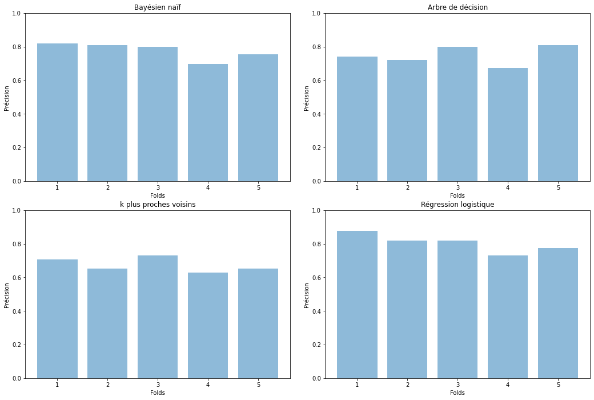

# L3-SID INTRODUCTION AU MACHINE LEARNING
## TP 3 + projet: Apprentissage via scikit-learn

## Objectifs du TP
Le travail sera commencé en séance puis terminé sous forme de projet qui
devra être rendu dans un rapport (préférablement sous format `.pdf`)
pour l’ensemble du TP. Il devra s’agir d’un travail PERSONNEL. Vous noterez vos réponses ainsi que vos commentaires, vos choix, vos figures et vos discussions sur les
résultats directement dans le notebook (ou un fichier .py et un rapport séparé compressés dans une archive). Le devoir devra être déposé sur moodle avant le 25 mai. 
Dans ce TP, on utilisera la base `titanic`.

## Chargement de la base et sélection des données

* Téléchargez la base *titanic.csv* et chargez-la dans un DataFrame (pandas), noté *df* (pandas).
* Affichez les attributs de la base et leur nombre. De quel type sont-ils (réels, nominaux ou variables binaires,...) ? Combien y a-t-il de classes ?
*  vous devez maintenant nettoyer la base :
    * Retirer les colonnes qui vous semblent inutiles pour l'apprentissage à l'aide de *df.drop(index)*
    * Certaines variables sont nominatives et scikit learn ne traite que des variables numériques. Transformer les variables numériques en variables binaires à de *pandas.get\_dummies*
    * remplacer les valeurs nan par la moyenne à l'aide de *df.fillna*
* Afin de créer une base d'apprentissage et une base de test, créez une fonction *split(df,p)* qui séparera et retournera deux DataFrames, notés *train* et *test* dont la taille est déterminée par un pourcentage *p* passé en paramètre (60/40%, 70/30%,...). Appliquez la fonction à *df*.


```python
!pip install nbconvert
!pip install pandas
!pip install numpy
!pip install matplotlib.pyplot
!pip install matplotlib
!pip install csv --upgrade
!pip install xelatex 
!pip install statistics 
```

    Requirement already satisfied: nbconvert in c:\programdata\anaconda3\lib\site-packages (5.6.1)
    Requirement already satisfied: traitlets>=4.2 in c:\programdata\anaconda3\lib\site-packages (from nbconvert) (4.3.3)
    Requirement already satisfied: jupyter-core in c:\programdata\anaconda3\lib\site-packages (from nbconvert) (4.6.3)
    Requirement already satisfied: pygments in c:\programdata\anaconda3\lib\site-packages (from nbconvert) (2.6.1)
    Requirement already satisfied: bleach in c:\programdata\anaconda3\lib\site-packages (from nbconvert) (3.1.5)
    Requirement already satisfied: entrypoints>=0.2.2 in c:\programdata\anaconda3\lib\site-packages (from nbconvert) (0.3)
    Requirement already satisfied: testpath in c:\programdata\anaconda3\lib\site-packages (from nbconvert) (0.4.4)
    Requirement already satisfied: jinja2>=2.4 in c:\programdata\anaconda3\lib\site-packages (from nbconvert) (2.11.2)
    Requirement already satisfied: mistune<2,>=0.8.1 in c:\programdata\anaconda3\lib\site-packages (from nbconvert) (0.8.4)
    Requirement already satisfied: nbformat>=4.4 in c:\programdata\anaconda3\lib\site-packages (from nbconvert) (5.0.7)
    Requirement already satisfied: pandocfilters>=1.4.1 in c:\programdata\anaconda3\lib\site-packages (from nbconvert) (1.4.2)
    Requirement already satisfied: defusedxml in c:\programdata\anaconda3\lib\site-packages (from nbconvert) (0.6.0)
    Requirement already satisfied: decorator in c:\programdata\anaconda3\lib\site-packages (from traitlets>=4.2->nbconvert) (4.4.2)
    Requirement already satisfied: ipython-genutils in c:\programdata\anaconda3\lib\site-packages (from traitlets>=4.2->nbconvert) (0.2.0)
    Requirement already satisfied: six in c:\programdata\anaconda3\lib\site-packages (from traitlets>=4.2->nbconvert) (1.15.0)
    Requirement already satisfied: pywin32>=1.0; sys_platform == "win32" in c:\programdata\anaconda3\lib\site-packages (from jupyter-core->nbconvert) (227)
    Requirement already satisfied: packaging in c:\programdata\anaconda3\lib\site-packages (from bleach->nbconvert) (20.4)
    Requirement already satisfied: webencodings in c:\programdata\anaconda3\lib\site-packages (from bleach->nbconvert) (0.5.1)
    Requirement already satisfied: MarkupSafe>=0.23 in c:\programdata\anaconda3\lib\site-packages (from jinja2>=2.4->nbconvert) (1.1.1)
    Requirement already satisfied: jsonschema!=2.5.0,>=2.4 in c:\programdata\anaconda3\lib\site-packages (from nbformat>=4.4->nbconvert) (3.2.0)
    Requirement already satisfied: pyparsing>=2.0.2 in c:\programdata\anaconda3\lib\site-packages (from packaging->bleach->nbconvert) (2.4.7)
    Requirement already satisfied: pyrsistent>=0.14.0 in c:\programdata\anaconda3\lib\site-packages (from jsonschema!=2.5.0,>=2.4->nbformat>=4.4->nbconvert) (0.16.0)
    Requirement already satisfied: setuptools in c:\programdata\anaconda3\lib\site-packages (from jsonschema!=2.5.0,>=2.4->nbformat>=4.4->nbconvert) (49.2.0.post20200714)
    Requirement already satisfied: attrs>=17.4.0 in c:\programdata\anaconda3\lib\site-packages (from jsonschema!=2.5.0,>=2.4->nbformat>=4.4->nbconvert) (19.3.0)
    Requirement already satisfied: pandas in c:\programdata\anaconda3\lib\site-packages (1.0.5)
    Requirement already satisfied: numpy>=1.13.3 in c:\programdata\anaconda3\lib\site-packages (from pandas) (1.18.5)
    Requirement already satisfied: python-dateutil>=2.6.1 in c:\programdata\anaconda3\lib\site-packages (from pandas) (2.8.1)
    Requirement already satisfied: pytz>=2017.2 in c:\programdata\anaconda3\lib\site-packages (from pandas) (2020.1)
    Requirement already satisfied: six>=1.5 in c:\programdata\anaconda3\lib\site-packages (from python-dateutil>=2.6.1->pandas) (1.15.0)
    Requirement already satisfied: numpy in c:\programdata\anaconda3\lib\site-packages (1.18.5)
    

    ERROR: Could not find a version that satisfies the requirement matplotlib.pyplot (from versions: none)
    ERROR: No matching distribution found for matplotlib.pyplot
    

    Requirement already satisfied: matplotlib in c:\programdata\anaconda3\lib\site-packages (3.2.2)
    Requirement already satisfied: cycler>=0.10 in c:\programdata\anaconda3\lib\site-packages (from matplotlib) (0.10.0)
    Requirement already satisfied: pyparsing!=2.0.4,!=2.1.2,!=2.1.6,>=2.0.1 in c:\programdata\anaconda3\lib\site-packages (from matplotlib) (2.4.7)
    Requirement already satisfied: kiwisolver>=1.0.1 in c:\programdata\anaconda3\lib\site-packages (from matplotlib) (1.2.0)
    Requirement already satisfied: python-dateutil>=2.1 in c:\programdata\anaconda3\lib\site-packages (from matplotlib) (2.8.1)
    Requirement already satisfied: numpy>=1.11 in c:\programdata\anaconda3\lib\site-packages (from matplotlib) (1.18.5)
    Requirement already satisfied: six in c:\programdata\anaconda3\lib\site-packages (from cycler>=0.10->matplotlib) (1.15.0)
    

    ERROR: Could not find a version that satisfies the requirement csv (from versions: none)
    ERROR: No matching distribution found for csv
    ERROR: Could not find a version that satisfies the requirement xelatex (from versions: none)
    ERROR: No matching distribution found for xelatex
    


```python
import pandas as pd
import numpy as np
import matplotlib.pyplot as plt
import matplotlib as mat
import csv
import statistics
```

## Les données


```python
df = pd.read_csv('titanic.csv') # chargement du jeu de données
df.head() # on affiche les 5 premières lignes
```


<div>
<style scoped>
    .dataframe tbody tr th:only-of-type {
        vertical-align: middle;
    }

    .dataframe tbody tr th {
        vertical-align: top;
    }

    .dataframe thead th {
        text-align: right;
    }
</style>
<table border="1" class="dataframe">
  <thead>
    <tr style="text-align: right;">
      <th></th>
      <th>PassengerId</th>
      <th>Survived</th>
      <th>Pclass</th>
      <th>Name</th>
      <th>Sex</th>
      <th>Age</th>
      <th>SibSp</th>
      <th>Parch</th>
      <th>Ticket</th>
      <th>Fare</th>
      <th>Cabin</th>
      <th>Embarked</th>
    </tr>
  </thead>
  <tbody>
    <tr>
      <th>0</th>
      <td>1</td>
      <td>0</td>
      <td>3</td>
      <td>Braund, Mr. Owen Harris</td>
      <td>male</td>
      <td>22.0</td>
      <td>1</td>
      <td>0</td>
      <td>A/5 21171</td>
      <td>7.2500</td>
      <td>NaN</td>
      <td>S</td>
    </tr>
    <tr>
      <th>1</th>
      <td>2</td>
      <td>1</td>
      <td>1</td>
      <td>Cumings, Mrs. John Bradley (Florence Briggs Th...</td>
      <td>female</td>
      <td>38.0</td>
      <td>1</td>
      <td>0</td>
      <td>PC 17599</td>
      <td>71.2833</td>
      <td>C85</td>
      <td>C</td>
    </tr>
    <tr>
      <th>2</th>
      <td>3</td>
      <td>1</td>
      <td>3</td>
      <td>Heikkinen, Miss. Laina</td>
      <td>female</td>
      <td>26.0</td>
      <td>0</td>
      <td>0</td>
      <td>STON/O2. 3101282</td>
      <td>7.9250</td>
      <td>NaN</td>
      <td>S</td>
    </tr>
    <tr>
      <th>3</th>
      <td>4</td>
      <td>1</td>
      <td>1</td>
      <td>Futrelle, Mrs. Jacques Heath (Lily May Peel)</td>
      <td>female</td>
      <td>35.0</td>
      <td>1</td>
      <td>0</td>
      <td>113803</td>
      <td>53.1000</td>
      <td>C123</td>
      <td>S</td>
    </tr>
    <tr>
      <th>4</th>
      <td>5</td>
      <td>0</td>
      <td>3</td>
      <td>Allen, Mr. William Henry</td>
      <td>male</td>
      <td>35.0</td>
      <td>0</td>
      <td>0</td>
      <td>373450</td>
      <td>8.0500</td>
      <td>NaN</td>
      <td>S</td>
    </tr>
  </tbody>
</table>
</div>


```python
print(df.columns) # on affiche la liste des variables de la base
print(len(df.columns)) # on affiche le nombre d'attributs
print(df.shape) # on affiche la taille du dataframe
print(df.info()) # on affiche la structure du DataFrame
print(df.describe(include='O')) # descriptions des variables qualitatives
df.describe() # statistiques descriptives univariées
```

    Index(['PassengerId', 'Survived', 'Pclass', 'Name', 'Sex', 'Age', 'SibSp',
           'Parch', 'Ticket', 'Fare', 'Cabin', 'Embarked'],
          dtype='object')
    12
    (891, 12)
    <class 'pandas.core.frame.DataFrame'>
    RangeIndex: 891 entries, 0 to 890
    Data columns (total 12 columns):
     #   Column       Non-Null Count  Dtype  
    ---  ------       --------------  -----  
     0   PassengerId  891 non-null    int64  
     1   Survived     891 non-null    int64  
     2   Pclass       891 non-null    int64  
     3   Name         891 non-null    object 
     4   Sex          891 non-null    object 
     5   Age          714 non-null    float64
     6   SibSp        891 non-null    int64  
     7   Parch        891 non-null    int64  
     8   Ticket       891 non-null    object 
     9   Fare         891 non-null    float64
     10  Cabin        204 non-null    object 
     11  Embarked     889 non-null    object 
    dtypes: float64(2), int64(5), object(5)
    memory usage: 83.7+ KB
    None
                          Name   Sex    Ticket    Cabin Embarked
    count                  891   891       891      204      889
    unique                 891     2       681      147        3
    top     Farrell, Mr. James  male  CA. 2343  B96 B98        S
    freq                     1   577         7        4      644
    


<div>
<style scoped>
    .dataframe tbody tr th:only-of-type {
        vertical-align: middle;
    }

    .dataframe tbody tr th {
        vertical-align: top;
    }

    .dataframe thead th {
        text-align: right;
    }
</style>
<table border="1" class="dataframe">
  <thead>
    <tr style="text-align: right;">
      <th></th>
      <th>PassengerId</th>
      <th>Survived</th>
      <th>Pclass</th>
      <th>Age</th>
      <th>SibSp</th>
      <th>Parch</th>
      <th>Fare</th>
    </tr>
  </thead>
  <tbody>
    <tr>
      <th>count</th>
      <td>891.000000</td>
      <td>891.000000</td>
      <td>891.000000</td>
      <td>714.000000</td>
      <td>891.000000</td>
      <td>891.000000</td>
      <td>891.000000</td>
    </tr>
    <tr>
      <th>mean</th>
      <td>446.000000</td>
      <td>0.383838</td>
      <td>2.308642</td>
      <td>29.699118</td>
      <td>0.523008</td>
      <td>0.381594</td>
      <td>32.204208</td>
    </tr>
    <tr>
      <th>std</th>
      <td>257.353842</td>
      <td>0.486592</td>
      <td>0.836071</td>
      <td>14.526497</td>
      <td>1.102743</td>
      <td>0.806057</td>
      <td>49.693429</td>
    </tr>
    <tr>
      <th>min</th>
      <td>1.000000</td>
      <td>0.000000</td>
      <td>1.000000</td>
      <td>0.420000</td>
      <td>0.000000</td>
      <td>0.000000</td>
      <td>0.000000</td>
    </tr>
    <tr>
      <th>25%</th>
      <td>223.500000</td>
      <td>0.000000</td>
      <td>2.000000</td>
      <td>20.125000</td>
      <td>0.000000</td>
      <td>0.000000</td>
      <td>7.910400</td>
    </tr>
    <tr>
      <th>50%</th>
      <td>446.000000</td>
      <td>0.000000</td>
      <td>3.000000</td>
      <td>28.000000</td>
      <td>0.000000</td>
      <td>0.000000</td>
      <td>14.454200</td>
    </tr>
    <tr>
      <th>75%</th>
      <td>668.500000</td>
      <td>1.000000</td>
      <td>3.000000</td>
      <td>38.000000</td>
      <td>1.000000</td>
      <td>0.000000</td>
      <td>31.000000</td>
    </tr>
    <tr>
      <th>max</th>
      <td>891.000000</td>
      <td>1.000000</td>
      <td>3.000000</td>
      <td>80.000000</td>
      <td>8.000000</td>
      <td>6.000000</td>
      <td>512.329200</td>
    </tr>
  </tbody>
</table>
</div>


Le DataFrame contient **891 observations** (=lignes) et **12 attributs** (=colonnes).

Nous avons des attributs de type quantitatifs et qualitatifs.

La variable *Cabin* a beaucoup de valeurs null.

Les attributs *Name*, *Ticket* et *Cabin* ont trop de valeurs uniques. Elles n'apportent pas dinformations.

On distingue **2 classes** (1 si le passager a survécu et 0 s’il est décédé) qui correspondent à la variable *Survived*. C'est la variable que nous cherchons à déterminer/prédire.


```python
# répartition de la classe Survived
print('Part des survivants : ', round(len(df[df['Survived']==1]) / len(df['Survived']) * 100, 1), '%')
print('Part des non-survivants : ', round(len(df[df['Survived']==0]) / len(df['Survived']) * 100, 1), '%')
df.groupby(['Sex']).mean() # comparaison des modalités de la variable Sex sur les autres variables
```

    Part des survivants :  38.4 %
    Part des non-survivants :  61.6 %
    


<div>
<style scoped>
    .dataframe tbody tr th:only-of-type {
        vertical-align: middle;
    }

    .dataframe tbody tr th {
        vertical-align: top;
    }

    .dataframe thead th {
        text-align: right;
    }
</style>
<table border="1" class="dataframe">
  <thead>
    <tr style="text-align: right;">
      <th></th>
      <th>PassengerId</th>
      <th>Survived</th>
      <th>Pclass</th>
      <th>Age</th>
      <th>SibSp</th>
      <th>Parch</th>
      <th>Fare</th>
    </tr>
    <tr>
      <th>Sex</th>
      <th></th>
      <th></th>
      <th></th>
      <th></th>
      <th></th>
      <th></th>
      <th></th>
    </tr>
  </thead>
  <tbody>
    <tr>
      <th>female</th>
      <td>431.028662</td>
      <td>0.742038</td>
      <td>2.159236</td>
      <td>27.915709</td>
      <td>0.694268</td>
      <td>0.649682</td>
      <td>44.479818</td>
    </tr>
    <tr>
      <th>male</th>
      <td>454.147314</td>
      <td>0.188908</td>
      <td>2.389948</td>
      <td>30.726645</td>
      <td>0.429809</td>
      <td>0.235702</td>
      <td>25.523893</td>
    </tr>
  </tbody>
</table>
</div>


74% des personnes qui ont survécus sont des femmes contre 19% d'hommes.

## Nettoyage de la base

Les colonnes qui me semblent inutiles pour la base d'apprentissage sont *PassengerId*, *SibSp* (=nombre d’époux, de frères ou de soeurs présents à bord), *Parch* (=nombre de parents ou d’enfants présents à bord), *Name*, *Ticket* et *Cabin*.


```python
df = df.drop(['PassengerId','SibSp','Parch','Name','Ticket','Cabin'], axis=1) # je supprime les variables inutiles
print(df.columns) # on affiche la nouvelle liste des variables d'apprentissage (features) et la classe (target)
```

    Index(['Survived', 'Pclass', 'Sex', 'Age', 'Fare', 'Embarked'], dtype='object')
    

Nous retenons donc 4 variables explicatives (2 quantitatives et 2 qualitatives) ainsi que la classe à prédire *Survived*.


```python
df = pd.get_dummies(df, columns=['Pclass','Sex', 'Embarked']) # convertion de la variable Pclass, Sex et Embarked en type quantitatif binaire
```

On remarque des valeurs manquantes pour la variable *Age*


```python
print(df.isnull().sum())
df = df.fillna(df['Age'].mean()) # on remplace les valeurs nan par la moyenne
print(df.head()) # affichage du nouveau DataFrame nettoyé
df.info() # les valeurs nulles ont été remplacés par la moyenne
```

    Survived        0
    Age           177
    Fare            0
    Pclass_1        0
    Pclass_2        0
    Pclass_3        0
    Sex_female      0
    Sex_male        0
    Embarked_C      0
    Embarked_Q      0
    Embarked_S      0
    dtype: int64
       Survived   Age     Fare  Pclass_1  Pclass_2  Pclass_3  Sex_female  \
    0         0  22.0   7.2500         0         0         1           0   
    1         1  38.0  71.2833         1         0         0           1   
    2         1  26.0   7.9250         0         0         1           1   
    3         1  35.0  53.1000         1         0         0           1   
    4         0  35.0   8.0500         0         0         1           0   
    
       Sex_male  Embarked_C  Embarked_Q  Embarked_S  
    0         1           0           0           1  
    1         0           1           0           0  
    2         0           0           0           1  
    3         0           0           0           1  
    4         1           0           0           1  
    <class 'pandas.core.frame.DataFrame'>
    RangeIndex: 891 entries, 0 to 890
    Data columns (total 11 columns):
     #   Column      Non-Null Count  Dtype  
    ---  ------      --------------  -----  
     0   Survived    891 non-null    int64  
     1   Age         891 non-null    float64
     2   Fare        891 non-null    float64
     3   Pclass_1    891 non-null    uint8  
     4   Pclass_2    891 non-null    uint8  
     5   Pclass_3    891 non-null    uint8  
     6   Sex_female  891 non-null    uint8  
     7   Sex_male    891 non-null    uint8  
     8   Embarked_C  891 non-null    uint8  
     9   Embarked_Q  891 non-null    uint8  
     10  Embarked_S  891 non-null    uint8  
    dtypes: float64(2), int64(1), uint8(8)
    memory usage: 28.0 KB
    

## Création d'une base d'apprentissage et d'une base de test

Avec la fonction **split** à la "main".


```python
def split(df,p=0.6): 
    # fonction split qui sépare et retourne deux DataFrames selon la valeur de p (=train_size)
    # entrées : 
        # - df : DataFrame complet
        # - p : taille de train_size (par défaut p=0.6)
    # sorties : 
        # - train : échantillon d'entraînement
        # - test : : échantillon de test
    train = df.sample(frac=p,replace=False)
    test = df.sample(frac=(1-p),replace=False)
    return train, test

# test de la fonction split (taille 60%, 40%)
train, test = split(df,0.6)
print('Nb lignes échantillon d\'entraînement : ', len(train)) # échantilllon pour entrainer le modèle
print('Nb lignes échantillon de test : ', len(test)) # sert à évaluer la prformance du modèle
```

    Nb lignes échantillon d'entraînement :  535
    Nb lignes échantillon de test :  356
    

En utilisant la fonction **train_test_split** de scikit-learn.


```python
from sklearn.model_selection import train_test_split # importation de la fonction train_test_split
def split(df,y,p=0.6): 
    # fonction split qui sépare et retourne 2 DataFrames selon la valeur de p (=train_size)
    # entrées : 
        # - df : DataFrame complet
        # - y : target
        # - p : taille de train_size (par défaut p=0.6)
    # sorties : 
        # - train_test_split : fonction scikit-learn qui renvoie X_train, X_test, Y_train et Y_test    
    X = df.drop(y,axis=1) # features
    Y = df[y] # target
    return train_test_split(X,Y,train_size=p) # j'utilise la fonction train_test_split de scikit-learn

# test de la fonction split (taille 60%, 40%)
y = 'Survived' # target
X_train, X_test, Y_train, Y_test = split(df,y) # appel de la fonction split
print('Nb lignes échantillons d\'entraînement : ', len(X_train)) # échantilllon pour entrainer le modèle
print('Nb lignes échantillons de test : ', len(X_test)) # sert à évaluer la performance du modèle
```

    Nb lignes échantillons d'entraînement :  534
    Nb lignes échantillons de test :  357
    

# Entropie
Le but ici est de caculer l'entropie et de gain d'entropie comme pour la construction d'un arbre de décision.
* Ecrire une fonction entropie qui prend une liste (ou un array numpy) de valeur binaires et qui calcule l'entropie. Appliquer cette fonction sur la classe.
* Ecrire une fonction gain d'entropie qui prend une liste pour la classe (en binaire) et une liste pour les valeurs correspondantes d'un autre attribut (binaire aussi) 
* Calculer le gain d'entropie pour l'attribut pour le sexe et toutes les autres variables binaires que vous avez crées. Quelle serait le meilleur attribut pour démarrer un arbre de décision ?

## Fonction entropie


```python
from math import *

def log2(x):
    # fonction pour calculer le log2 utilisé dans la fonction entropie
    return log(x)/log(2)

def entropie(n1,n2):
    # fonction entropie qui retourne la valeur de l'entropie
    # entrées :
        # - n1 : nombre de valeurs dans la classe 0 (Survived=0)
        # - n2 : nombre de valeurs dans la classe 1 (Survived=1)
    # sortie :
        # - valeur de l'entropie
    p1 = n1/(n1+n2)
    p2 = n2/(n1+n2)
    if n1 == 0 or n2 == 0:
        return 0
    else:
        return -p1*log2(p1)-p2*log2(p2)
    
# test de la fonction entropie sur la classe Survived
n1=len(df[df['Survived']==0])
n2=len(df[df['Survived']==1])
print('Entropie de la classe Survived : ',round(entropie(n1,n2),2))
```

    Entropie de la classe Survived :  0.96
    

La classe *Survived* est homogène, il y a une bonne répartition des valeurs binaires (équilibré). Il y a autant d'individus survivants que non survivants.

## Fonction gain d'entropie


```python
def gain(S,l):
    # fonction gain d'entropie qui retourne la valeur du gain d'entropie d'un attribut
    # entrées :
        # - S : nb observations dans chaque classe
        # - l
    # sorties : 
        # - g : valeur du gain d'entropie
    sp,sn = S
    nb = sp + sn 
    ent_s = entropie(sp,sn)
    g = ent_s
    for ap,an in l:
        g = g - (ap+an)/nb * entropie(ap,an)
    return g
```

Gain d'entropie pour la variable *Sexe* (variable binaire) :


```python
# test de la fonction gain d'entropie sur le Sexe
#print(df.groupby(['Sex_male']).sum())
#print(df.groupby(['Sex_female']).sum())

n0=len(df[df['Survived']==0])
n1=len(df[df['Survived']==1])

sf0=109 # nombre de décès chez les femmes
sf1=233 # nombre de survivants chez les femmes

sm0=233 # nombre de décès chez les hommes
sm1=109 # nombre de survivants chez les hommes

print('Gain d\'entropie pour la variable Sexe : ',gain((n0,n1),[(sf0,sf1),(sm0,sm1)]))
```

    Gain d'entropie pour la variable Sexe :  0.26751352031370584
    

Gain d'entropie pour la variable *Pclass* (variable binaire) :


```python
# test de la fonction gain d'entropie sur Pclass
#print(df.groupby(['Pclass_1']).sum())
#print(df.groupby(['Pclass_2']).sum())
#print(df.groupby(['Pclass_3']).sum())

n0=len(df[df['Survived']==0])
n1=len(df[df['Survived']==1])

s10=206 # nombre de décès pour la classe 1
s11=136 # nombre de survivants pour la classe 1

s20=255 # nombre de décès pour la classe 2
s21=87 # nombre de survivants pour la classe 2

s30=223 # nombre de décès pour la classe 3
s31=119 # nombre de survivants pour la classe 3

print('Gain d\'entropie pour la variable Pclass : ',gain((n0,n1),[(s10,s11),(s20,s21),(s30,s31)]))
```

    Gain d'entropie pour la variable Pclass :  -0.0833127751270698
    

Gain d'entropie pour la variable *Embarked* (variable binaire) :


```python
# test de la fonction gain d'entropie sur Embarked
#print(df.groupby(['Embarked_C']).sum())
#print(df.groupby(['Embarked_Q']).sum())
#print(df.groupby(['Embarked_S']).sum())

n0=len(df[df['Survived']==0])
n1=len(df[df['Survived']==1])

s10=249 # nombre de décès pour le port Cherbourg
s11=93 # nombre de survivants pour la classe Cherbourg

s20=312 # nombre de décès pour la classe Queenstown
s21=30 # nombre de survivants pour la classe Queenstown

s30=125 # nombre de décès pour la classe Southampton
s31=217 # nombre de survivants pour la classe Southampton

print('Gain d\'entropie pour la variable Embarked : ',gain((n0,n1),[(s10,s11),(s20,s21),(s30,s31)]))
```

    Gain d'entropie pour la variable Embarked :  0.10851646912767599
    

Le meilleur attribut pour démarrer un arbre de décision est la variable *Sexe* car le gain d'entropie (=0.27) est le plus élevé, la séparation n'est pas équilibrée (dissociation des deux classes, c'est un bon classifieur).

## Familiarisation avec quelques méthodes du package *scikit-learn*+
On utilisera les fonctions d'apprentissage bayésien naïf de *scikit-learn* pour prédire la classe de la base *test* créée précédemment lorsque le modèle prédictif est calculé à partir de la base d'apprentissage *train*. Pour cela, vous aurez besoin des fonctions:


```python
from sklearn.naive_bayes import GaussianNB # importation du module GaussianNB
clf = GaussianNB() # création du classifieur (bayésien naïf)
clf.fit(X_train,Y_train) # apprentissage du classfieur sur les données train
print(clf.predict(X_test)) # prédiction de la classe Survived avec la base de test
print(clf.predict_proba(X_test)) # probabilité d'appartenance à une classe
```

    [0 1 0 0 0 0 0 0 0 1 0 0 1 1 1 1 0 0 0 1 0 0 1 1 1 0 1 1 0 1 0 1 0 0 1 0 1
     1 0 0 0 0 1 1 0 0 0 0 1 1 0 0 0 0 1 0 0 0 0 1 1 0 0 1 0 0 1 0 0 0 0 1 0 1
     0 0 0 0 0 0 0 0 0 0 1 0 0 0 1 1 1 0 0 1 0 0 0 0 0 0 1 0 0 0 0 1 0 1 0 1 1
     0 1 0 1 1 0 0 0 1 0 1 0 1 0 0 1 0 0 0 0 1 1 1 1 0 0 0 1 1 1 1 1 0 0 1 1 0
     0 1 1 1 0 1 0 0 0 0 1 0 0 0 1 1 1 0 0 1 0 0 0 0 0 0 0 0 0 1 0 0 0 0 0 0 1
     0 1 0 0 1 0 1 0 0 0 1 1 1 0 0 1 0 0 0 0 0 0 1 0 0 1 1 1 0 0 1 1 0 0 0 0 0
     1 0 0 1 0 1 0 0 1 0 0 1 1 0 1 0 1 1 0 0 1 1 0 1 1 0 1 0 1 1 0 1 0 1 0 1 1
     0 0 1 0 1 1 1 0 0 1 1 1 0 0 0 0 1 1 1 0 1 0 0 1 1 0 0 0 1 1 0 1 0 0 0 1 0
     1 1 1 1 1 0 1 0 0 0 0 1 0 0 0 0 0 0 1 0 0 0 1 1 1 0 0 1 1 0 0 0 0 1 0 0 0
     0 0 0 1 0 0 0 1 0 0 0 0 1 1 0 1 0 1 0 1 0 1 1 0]
    [[7.86640587e-01 2.13359413e-01]
     [1.15247763e-02 9.88475224e-01]
     [9.73932145e-01 2.60678545e-02]
     [9.98150503e-01 1.84949651e-03]
     [9.98048342e-01 1.95165835e-03]
     [9.97854377e-01 2.14562342e-03]
     [8.20550099e-01 1.79449901e-01]
     [9.79167166e-01 2.08328342e-02]
     [9.95787923e-01 4.21207680e-03]
     [2.51807575e-01 7.48192425e-01]
     [9.97317503e-01 2.68249740e-03]
     [9.46598287e-01 5.34017131e-02]
     [1.30910911e-01 8.69089089e-01]
     [2.42240476e-01 7.57759524e-01]
     [1.54328407e-01 8.45671593e-01]
     [1.09262702e-02 9.89073730e-01]
     [9.95214803e-01 4.78519659e-03]
     [8.61015318e-01 1.38984682e-01]
     [9.47558786e-01 5.24412144e-02]
     [1.30968211e-01 8.69031789e-01]
     [8.30486084e-01 1.69513916e-01]
     [9.98126547e-01 1.87345299e-03]
     [2.54587832e-02 9.74541217e-01]
     [2.46939655e-01 7.53060345e-01]
     [1.24640120e-02 9.87535988e-01]
     [9.50215174e-01 4.97848264e-02]
     [1.16227899e-02 9.88377210e-01]
     [4.33058619e-01 5.66941381e-01]
     [8.03625012e-01 1.96374988e-01]
     [9.35818732e-03 9.90641813e-01]
     [9.98109581e-01 1.89041858e-03]
     [4.21963898e-03 9.95780361e-01]
     [9.47558786e-01 5.24412144e-02]
     [9.46690827e-01 5.33091734e-02]
     [1.30968211e-01 8.69031789e-01]
     [9.97724274e-01 2.27572590e-03]
     [3.23943149e-01 6.76056851e-01]
     [5.94911342e-04 9.99405089e-01]
     [9.77284837e-01 2.27151628e-02]
     [8.13690140e-01 1.86309860e-01]
     [9.98135657e-01 1.86434251e-03]
     [9.98039495e-01 1.96050510e-03]
     [4.67501675e-07 9.99999532e-01]
     [3.65691002e-01 6.34308998e-01]
     [8.64518318e-01 1.35481682e-01]
     [9.47244126e-01 5.27558744e-02]
     [9.97712605e-01 2.28739481e-03]
     [9.98135657e-01 1.86434251e-03]
     [2.37005266e-01 7.62994734e-01]
     [2.23848225e-02 9.77615178e-01]
     [8.69089495e-01 1.30910505e-01]
     [9.96462991e-01 3.53700923e-03]
     [9.96192077e-01 3.80792293e-03]
     [9.43626400e-01 5.63735998e-02]
     [1.11946272e-02 9.88805373e-01]
     [9.97771029e-01 2.22897105e-03]
     [9.97756531e-01 2.24346894e-03]
     [8.55683863e-01 1.44316137e-01]
     [9.97938378e-01 2.06162220e-03]
     [6.60057607e-05 9.99933994e-01]
     [1.84054916e-01 8.15945084e-01]
     [9.95739164e-01 4.26083558e-03]
     [9.95588397e-01 4.41160253e-03]
     [2.12948095e-01 7.87051905e-01]
     [9.97908714e-01 2.09128627e-03]
     [9.97966302e-01 2.03369774e-03]
     [2.34754791e-01 7.65245209e-01]
     [9.98092853e-01 1.90714692e-03]
     [9.98134523e-01 1.86547718e-03]
     [9.98085193e-01 1.91480704e-03]
     [8.44383123e-01 1.55616877e-01]
     [1.52945475e-01 8.47054525e-01]
     [9.97939542e-01 2.06045824e-03]
     [1.30705644e-03 9.98692944e-01]
     [9.98148129e-01 1.85187063e-03]
     [8.69320931e-01 1.30679069e-01]
     [9.78482759e-01 2.15172414e-02]
     [9.95079878e-01 4.92012240e-03]
     [9.76085106e-01 2.39148942e-02]
     [9.98156733e-01 1.84326742e-03]
     [9.98100788e-01 1.89921174e-03]
     [9.98120611e-01 1.87938908e-03]
     [9.98134523e-01 1.86547718e-03]
     [9.16485040e-01 8.35149596e-02]
     [3.51945230e-01 6.48054770e-01]
     [9.95737789e-01 4.26221093e-03]
     [9.95619908e-01 4.38009170e-03]
     [9.98181732e-01 1.81826848e-03]
     [1.48138459e-02 9.85186154e-01]
     [7.54567710e-03 9.92454323e-01]
     [1.31522968e-01 8.68477032e-01]
     [9.97771029e-01 2.22897105e-03]
     [9.51090947e-01 4.89090535e-02]
     [1.87885276e-01 8.12114724e-01]
     [9.50740510e-01 4.92594905e-02]
     [9.51168504e-01 4.88314956e-02]
     [9.97402481e-01 2.59751890e-03]
     [9.50383835e-01 4.96161646e-02]
     [7.71260945e-01 2.28739055e-01]
     [9.98134523e-01 1.86547718e-03]
     [4.68542366e-07 9.99999531e-01]
     [9.47161490e-01 5.28385101e-02]
     [9.96116697e-01 3.88330341e-03]
     [9.97876549e-01 2.12345143e-03]
     [9.50132772e-01 4.98672280e-02]
     [1.38804083e-01 8.61195917e-01]
     [9.48626820e-01 5.13731803e-02]
     [1.15053839e-02 9.88494616e-01]
     [9.36939952e-01 6.30600479e-02]
     [4.38444525e-04 9.99561555e-01]
     [8.11474701e-04 9.99188525e-01]
     [9.47558786e-01 5.24412144e-02]
     [9.44097232e-02 9.05590277e-01]
     [9.98139826e-01 1.86017360e-03]
     [2.27606259e-01 7.72393741e-01]
     [2.84325885e-04 9.99715674e-01]
     [9.98121544e-01 1.87845573e-03]
     [9.32835623e-01 6.71643775e-02]
     [9.98129919e-01 1.87008069e-03]
     [3.57110864e-01 6.42889136e-01]
     [6.12150122e-01 3.87849878e-01]
     [1.51376693e-02 9.84862331e-01]
     [9.78839125e-01 2.11608746e-02]
     [3.02708762e-01 6.97291238e-01]
     [9.47296749e-01 5.27032512e-02]
     [9.50830315e-01 4.91696849e-02]
     [4.07261504e-01 5.92738496e-01]
     [8.00283681e-01 1.99716319e-01]
     [9.98098275e-01 1.90172511e-03]
     [9.98111725e-01 1.88827549e-03]
     [9.93850268e-01 6.14973167e-03]
     [9.17614166e-02 9.08238583e-01]
     [4.11113137e-03 9.95888869e-01]
     [1.19994663e-02 9.88000534e-01]
     [1.25056112e-02 9.87494389e-01]
     [9.98135657e-01 1.86434251e-03]
     [9.95769535e-01 4.23046473e-03]
     [9.46205841e-01 5.37941593e-02]
     [2.14599455e-01 7.85400545e-01]
     [4.65703896e-05 9.99953430e-01]
     [1.21418217e-02 9.87858178e-01]
     [1.30960363e-01 8.69039637e-01]
     [4.82059639e-42 1.00000000e+00]
     [7.89156446e-01 2.10843554e-01]
     [9.58546452e-01 4.14535476e-02]
     [3.95393568e-04 9.99604606e-01]
     [2.56320316e-01 7.43679684e-01]
     [9.95737789e-01 4.26221093e-03]
     [9.79186389e-01 2.08136108e-02]
     [1.69974529e-01 8.30025471e-01]
     [1.07995818e-05 9.99989200e-01]
     [1.24518823e-02 9.87548118e-01]
     [9.95737789e-01 4.26221093e-03]
     [6.48437760e-03 9.93515622e-01]
     [9.42690654e-01 5.73093457e-02]
     [8.68117270e-01 1.31882730e-01]
     [9.98134523e-01 1.86547718e-03]
     [9.97252131e-01 2.74786905e-03]
     [1.15053839e-02 9.88494616e-01]
     [8.69793882e-01 1.30206118e-01]
     [9.76512392e-01 2.34876077e-02]
     [9.79086620e-01 2.09133805e-02]
     [2.48267659e-01 7.51732341e-01]
     [1.63238247e-08 9.99999984e-01]
     [1.02974123e-02 9.89702588e-01]
     [9.96161777e-01 3.83822323e-03]
     [8.71388827e-01 1.28611173e-01]
     [1.21407079e-02 9.87859292e-01]
     [9.98129397e-01 1.87060326e-03]
     [9.98168343e-01 1.83165730e-03]
     [9.98091188e-01 1.90881156e-03]
     [9.48149099e-01 5.18509006e-02]
     [9.98072865e-01 1.92713510e-03]
     [9.48542833e-01 5.14571667e-02]
     [9.96970309e-01 3.02969092e-03]
     [9.44961510e-01 5.50384896e-02]
     [9.98167005e-01 1.83299517e-03]
     [2.10205040e-01 7.89794960e-01]
     [9.98084159e-01 1.91584121e-03]
     [9.96284946e-01 3.71505373e-03]
     [9.47978963e-01 5.20210368e-02]
     [9.98162323e-01 1.83767656e-03]
     [9.31452977e-01 6.85470230e-02]
     [9.97865221e-01 2.13477870e-03]
     [1.96176769e-01 8.03823231e-01]
     [9.42917036e-01 5.70829639e-02]
     [3.49153330e-05 9.99965085e-01]
     [9.98053093e-01 1.94690677e-03]
     [9.03412092e-01 9.65879080e-02]
     [1.21432688e-01 8.78567312e-01]
     [9.97856730e-01 2.14327018e-03]
     [2.35379205e-01 7.64620795e-01]
     [9.93850268e-01 6.14973167e-03]
     [9.96240706e-01 3.75929439e-03]
     [9.98144657e-01 1.85534274e-03]
     [6.51037306e-05 9.99934896e-01]
     [1.99989733e-02 9.80001027e-01]
     [2.58361042e-01 7.41638958e-01]
     [9.97811480e-01 2.18851968e-03]
     [9.97895836e-01 2.10416398e-03]
     [4.89276364e-05 9.99951072e-01]
     [9.51530068e-01 4.84699322e-02]
     [9.91081310e-01 8.91868972e-03]
     [9.48626820e-01 5.13731803e-02]
     [9.97715114e-01 2.28488643e-03]
     [9.79127980e-01 2.08720203e-02]
     [9.50445856e-01 4.95541437e-02]
     [2.94271089e-01 7.05728911e-01]
     [9.98147545e-01 1.85245545e-03]
     [9.51137190e-01 4.88628095e-02]
     [3.60653980e-01 6.39346020e-01]
     [1.48914947e-01 8.51085053e-01]
     [1.65902508e-06 9.99998341e-01]
     [9.98078343e-01 1.92165657e-03]
     [9.79388428e-01 2.06115723e-02]
     [8.38426213e-04 9.99161574e-01]
     [3.03307219e-06 9.99996967e-01]
     [9.78936939e-01 2.10630606e-02]
     [9.97810551e-01 2.18944891e-03]
     [9.51530068e-01 4.84699322e-02]
     [9.79167553e-01 2.08324470e-02]
     [9.97904683e-01 2.09531665e-03]
     [1.16351432e-01 8.83648568e-01]
     [9.98010970e-01 1.98902955e-03]
     [9.97932742e-01 2.06725793e-03]
     [2.53171516e-01 7.46828484e-01]
     [8.69320931e-01 1.30679069e-01]
     [2.04897300e-14 1.00000000e+00]
     [9.97643192e-01 2.35680795e-03]
     [6.29183181e-01 3.70816819e-01]
     [2.39940377e-01 7.60059623e-01]
     [9.47680639e-01 5.23193606e-02]
     [9.98078334e-01 1.92166619e-03]
     [1.09461410e-01 8.90538590e-01]
     [7.00583417e-07 9.99999299e-01]
     [9.98074037e-01 1.92596301e-03]
     [9.19314842e-03 9.90806852e-01]
     [9.98055079e-01 1.94492142e-03]
     [1.17342296e-02 9.88265770e-01]
     [3.65261913e-04 9.99634738e-01]
     [9.48493984e-01 5.15060165e-02]
     [9.98156733e-01 1.84326742e-03]
     [2.40333831e-01 7.59666169e-01]
     [2.41888549e-01 7.58111451e-01]
     [9.98134523e-01 1.86547718e-03]
     [1.54003001e-01 8.45996999e-01]
     [1.14145572e-02 9.88585443e-01]
     [9.79128368e-01 2.08716324e-02]
     [7.12800018e-04 9.99287200e-01]
     [9.97856138e-01 2.14386194e-03]
     [1.02525066e-02 9.89747493e-01]
     [9.44097232e-02 9.05590277e-01]
     [9.04654820e-01 9.53451801e-02]
     [1.16227899e-02 9.88377210e-01]
     [9.96032817e-01 3.96718316e-03]
     [1.24722391e-02 9.87527761e-01]
     [9.97895239e-01 2.10476115e-03]
     [2.37470929e-01 7.62529071e-01]
     [7.68716469e-02 9.23128353e-01]
     [9.98127686e-01 1.87231375e-03]
     [9.97931701e-01 2.06829922e-03]
     [1.41898462e-03 9.98581015e-01]
     [9.98043161e-01 1.95683850e-03]
     [1.09250100e-02 9.89074990e-01]
     [1.17581893e-02 9.88241811e-01]
     [1.25086821e-02 9.87491318e-01]
     [8.38282265e-01 1.61717735e-01]
     [9.98156518e-01 1.84348237e-03]
     [2.09656706e-01 7.90343294e-01]
     [1.30968211e-01 8.69031789e-01]
     [6.74436125e-03 9.93255639e-01]
     [9.97908941e-01 2.09105852e-03]
     [7.67279600e-01 2.32720400e-01]
     [9.98134523e-01 1.86547718e-03]
     [9.97963138e-01 2.03686188e-03]
     [2.35533906e-01 7.64466094e-01]
     [7.35959360e-07 9.99999264e-01]
     [1.30968211e-01 8.69031789e-01]
     [9.98110345e-01 1.88965462e-03]
     [8.97413401e-05 9.99910259e-01]
     [9.98156209e-01 1.84379069e-03]
     [9.95722734e-01 4.27726638e-03]
     [1.01254641e-02 9.89874536e-01]
     [1.91590160e-03 9.98084098e-01]
     [9.46622122e-01 5.33778779e-02]
     [9.98168343e-01 1.83165730e-03]
     [9.50131406e-01 4.98685943e-02]
     [1.48467921e-09 9.99999999e-01]
     [2.60987810e-01 7.39012190e-01]
     [9.36939952e-01 6.30600479e-02]
     [1.57867149e-01 8.42132851e-01]
     [8.61130775e-01 1.38869225e-01]
     [9.98067158e-01 1.93284212e-03]
     [9.95720872e-01 4.27912789e-03]
     [3.46892480e-07 9.99999653e-01]
     [8.01480986e-01 1.98519014e-01]
     [1.20738088e-02 9.87926191e-01]
     [7.68866769e-05 9.99923113e-01]
     [9.83752133e-03 9.90162479e-01]
     [1.31028122e-01 8.68971878e-01]
     [3.65691002e-01 6.34308998e-01]
     [8.54644798e-01 1.45355202e-01]
     [2.57996236e-01 7.42003764e-01]
     [5.73423705e-01 4.26576295e-01]
     [5.31453372e-01 4.68546628e-01]
     [9.98135657e-01 1.86434251e-03]
     [9.98049352e-01 1.95064792e-03]
     [2.87577134e-01 7.12422866e-01]
     [9.95776340e-01 4.22366009e-03]
     [8.69089495e-01 1.30910505e-01]
     [9.98157890e-01 1.84211030e-03]
     [6.06832030e-01 3.93167970e-01]
     [9.98129397e-01 1.87060326e-03]
     [9.97901572e-01 2.09842785e-03]
     [1.04134585e-11 1.00000000e+00]
     [9.43973061e-01 5.60269390e-02]
     [9.96345244e-01 3.65475647e-03]
     [9.45494010e-01 5.45059898e-02]
     [2.30831652e-01 7.69168348e-01]
     [9.11970659e-04 9.99088029e-01]
     [2.52416359e-01 7.47583641e-01]
     [9.97933758e-01 2.06624165e-03]
     [9.98139226e-01 1.86077449e-03]
     [2.40352605e-01 7.59647395e-01]
     [3.72035689e-03 9.96279643e-01]
     [9.47558786e-01 5.24412144e-02]
     [9.98135657e-01 1.86434251e-03]
     [7.59543061e-01 2.40456939e-01]
     [9.95545703e-01 4.45429688e-03]
     [2.97408589e-02 9.70259141e-01]
     [9.96892858e-01 3.10714172e-03]
     [9.95405252e-01 4.59474824e-03]
     [9.93850268e-01 6.14973167e-03]
     [9.97997595e-01 2.00240519e-03]
     [9.95737351e-01 4.26264936e-03]
     [7.37100966e-01 2.62899034e-01]
     [1.00688590e-02 9.89931141e-01]
     [9.98134523e-01 1.86547718e-03]
     [9.50964921e-01 4.90350789e-02]
     [8.69711302e-01 1.30288698e-01]
     [2.28421276e-01 7.71578724e-01]
     [9.36660251e-01 6.33397491e-02]
     [9.44969091e-01 5.50309088e-02]
     [9.45631109e-01 5.43688912e-02]
     [9.98150503e-01 1.84949651e-03]
     [4.50637316e-05 9.99954936e-01]
     [1.00688590e-02 9.89931141e-01]
     [9.97857622e-01 2.14237786e-03]
     [2.15750558e-04 9.99784249e-01]
     [9.79127980e-01 2.08720203e-02]
     [2.56709803e-01 7.43290197e-01]
     [8.07231125e-01 1.92768875e-01]
     [6.09978690e-05 9.99939002e-01]
     [9.97927556e-01 2.07244370e-03]
     [1.08689819e-02 9.89131018e-01]
     [2.36940694e-03 9.97630593e-01]
     [9.97203168e-01 2.79683176e-03]]
    

S'aider de l'aide en ligne (http://scikit-learn.org) pour l'utilisation de la méthode.
* Quels sont les paramètres de réglage de la méthode ?


```python
clf.get_params() # affichage des paramètres de la méthode GaussianNB avec get_params
```


    {'priors': None, 'var_smoothing': 1e-09}


J'obtient les paramètres de la méthode **GaussianNB** avec **get_params**. Les paramètres de réglage sont donc **priors** (probabilités antérieures des classes) et **var_smoothing** (lissage de la variance). Ici par défaut, priors=None car les probabilités antérieures des classes ne sont pas ajustés en fonction des données et var_smoothing=1e-09.

Lors de la recherche des paramètres optimaux, je calculerais le taux de précision suivant différentes valeurs de **var_smoothing**.

Le paramètre par défaut dans la fonction **fit** est **sample_weight=None** car on accorde le même poids à chaque observations (=1).

L'entraînement du classifieur supervisé se construit à partir de la fonction **fit** sur la base d'entraînement (X_train,Y_train).

La prédiction de la classe utilise la fonction **predict** sur la base de test (X_test).

* Créez une fonction *prediction(labels,pred)* qui renverra le taux de prédiction (en %) pour une prédiction stockée dans *pred* et les valeurs souhaitées stockées dans *label*. On calculera le taux de prédiction de l'apprentissage bayésien naïf sur la base *test*.


```python
def prediction(label,pred):
    # fonction pour calculer le taux de prédiction sur la base test (prédiction juste)
    # entrées :
        # - label : vecteurs des valeurs attendues (Y_test)
        # - pred : vecteurs des prédiction de X_test
    # sorties : 
        # - taux : taux de prédiction (en %)
    sum = 0
    n = len(label)
    for i,j in zip(label,pred): # boucle simultanée
        if i == j:
            sum += 1  
    taux = sum/n
    return taux
    
# test de la fonction prediction
label = Y_test
pred = clf.predict(X_test)
print('Taux de prédiction du classifieur bayésien naïf : {:.1%}'.format(prediction(label,pred)))
```

    Taux de prédiction du classifieur bayésien naïf : 77.6%
    

On peut également déterminer la précision avec la fonction **accuracy_score** :


```python
from sklearn.metrics import accuracy_score
pred = clf.predict(X_test)
print('Taux de prédiction du classifieur bayésien naïf : {:.1%}'.format(accuracy_score(Y_test,pred)))
```

    Taux de prédiction du classifieur bayésien naïf : 77.6%
    

Pour évaluer la qualité du prédicteur, on peut aussi calculer la **matrice de confusion** :


```python
from sklearn.metrics import confusion_matrix
conf = confusion_matrix(label, pred)
conf
```


    array([[183,  46],
           [ 34,  94]], dtype=int64)


Avec la matrice de confusion, on voit que le classifieur se trompe peut.
Si on effectue la somme de la diagonale sur le nombre d'observations, on retrouve la précision.

* Répétez les questions précédentes avec la méthode des **arbres de décision**. Pour cela vous aurez besoin des fonctions:


```python
from sklearn import tree
clf = tree.DecisionTreeClassifier() # création du classifieur (arbre de décision)
clf.fit(X_train,Y_train) # apprentissage du classfieur sur les données train
clf.predict(X_test) # prédiction de la classe Survived avec la base de test
```


    array([1, 1, 0, 0, 0, 0, 0, 0, 0, 1, 0, 0, 1, 0, 1, 1, 0, 0, 0, 1, 0, 0,
           0, 1, 1, 1, 1, 0, 0, 1, 1, 1, 0, 0, 1, 0, 0, 1, 0, 0, 0, 0, 0, 1,
           1, 0, 0, 0, 0, 1, 1, 0, 0, 0, 1, 0, 0, 1, 0, 1, 1, 0, 0, 0, 0, 0,
           1, 0, 0, 0, 1, 0, 0, 1, 0, 0, 1, 0, 0, 0, 0, 0, 0, 1, 0, 0, 0, 0,
           1, 1, 1, 0, 0, 0, 0, 0, 0, 0, 1, 0, 1, 0, 0, 0, 0, 0, 0, 1, 0, 1,
           1, 0, 0, 0, 0, 0, 0, 0, 0, 0, 0, 1, 1, 0, 0, 0, 1, 1, 0, 0, 0, 0,
           1, 1, 1, 0, 0, 0, 1, 1, 1, 1, 1, 0, 1, 1, 1, 0, 0, 1, 1, 1, 0, 1,
           0, 0, 0, 0, 1, 1, 0, 0, 0, 0, 1, 0, 1, 1, 0, 0, 0, 0, 0, 0, 0, 0,
           0, 0, 0, 1, 1, 0, 0, 1, 0, 0, 1, 0, 1, 0, 1, 0, 0, 0, 1, 1, 0, 1,
           0, 1, 1, 1, 0, 0, 0, 0, 0, 0, 0, 0, 0, 1, 1, 0, 0, 1, 1, 0, 0, 1,
           0, 1, 0, 0, 0, 1, 0, 1, 1, 0, 1, 0, 0, 0, 1, 0, 1, 0, 1, 1, 0, 0,
           0, 0, 0, 0, 1, 0, 1, 0, 1, 0, 1, 1, 0, 1, 0, 0, 0, 0, 1, 1, 0, 1,
           1, 1, 0, 0, 0, 1, 1, 0, 0, 0, 0, 0, 1, 1, 0, 1, 0, 0, 1, 0, 0, 0,
           0, 1, 1, 0, 0, 0, 0, 0, 1, 1, 1, 1, 1, 1, 1, 1, 1, 0, 1, 0, 0, 0,
           0, 1, 0, 0, 0, 0, 1, 0, 0, 0, 1, 1, 1, 0, 0, 0, 1, 0, 0, 1, 0, 0,
           0, 0, 0, 0, 0, 0, 1, 0, 0, 1, 0, 0, 0, 0, 0, 1, 1, 1, 1, 0, 0, 0,
           1, 0, 1, 1, 0], dtype=int64)


```python
clf.get_params() # affichage des paramètres de la méthode des arbres de décision avec get_params
```


    {'ccp_alpha': 0.0,
     'class_weight': None,
     'criterion': 'gini',
     'max_depth': None,
     'max_features': None,
     'max_leaf_nodes': None,
     'min_impurity_decrease': 0.0,
     'min_impurity_split': None,
     'min_samples_leaf': 1,
     'min_samples_split': 2,
     'min_weight_fraction_leaf': 0.0,
     'presort': 'deprecated',
     'random_state': None,
     'splitter': 'best'}


Par défaut, le paramètre de séparation d'un noeud se calcule avec la fonction gini.

Lors de la recherche des paramètres optimaux, je calculerais le taux de précision suivant différentes valeurs de **criterion** (fonction pour mesurer la qualité d'une scission qui est soit gini ou entropy).


```python
tree.plot_tree(clf) # résultat de l'arbre de décision
plt.show() # affichage de l'arbre
```


```python
# test de la fonction prediction
label = Y_test
pred = clf.predict(X_test)
print('Taux de prédiction de l\'arbre de décision : {:.1%}'.format(prediction(label,pred)))
```

    Taux de prédiction de l'arbre de décision : 77.0%
    

* Mêmes questions ensuite avec la méthode des *k* plus proches voisins et la regression logistique. Voir l'aide en ligne pour un descriptif de l'utilisation des méthodes. A chaque fois, précisez bien quels sont les paramètres de la méthode.


Méthode des **k plus proches voisins** :


```python
from sklearn.neighbors import KNeighborsClassifier
k = 5 # paramètre de réglage pour le nombre de plus proches voisins
clf = KNeighborsClassifier(n_neighbors=k) # création du classifieur (k plus proches voisins)
clf.fit(X_train,Y_train) # apprentissage du classfieur sur les données train
clf.predict(X_test) # prédiction de la classe Survived avec la base de test
```


    array([1, 1, 1, 0, 0, 0, 0, 0, 0, 0, 1, 0, 1, 1, 1, 1, 1, 1, 0, 1, 0, 0,
           1, 1, 1, 1, 0, 1, 0, 0, 0, 1, 0, 0, 1, 0, 0, 1, 0, 0, 0, 1, 1, 0,
           0, 0, 0, 0, 0, 1, 0, 0, 1, 0, 1, 0, 0, 0, 0, 1, 1, 0, 0, 0, 0, 0,
           0, 0, 0, 0, 1, 0, 0, 0, 0, 0, 1, 0, 0, 0, 1, 0, 0, 0, 1, 0, 0, 0,
           1, 0, 1, 0, 0, 0, 0, 0, 0, 0, 1, 0, 1, 0, 1, 0, 0, 0, 0, 0, 1, 1,
           1, 0, 0, 0, 0, 0, 1, 0, 0, 0, 0, 1, 0, 0, 0, 0, 1, 1, 0, 0, 0, 1,
           1, 1, 1, 0, 0, 0, 1, 1, 1, 1, 1, 1, 1, 1, 0, 0, 0, 1, 1, 0, 0, 0,
           0, 0, 0, 0, 0, 0, 0, 0, 0, 1, 1, 0, 1, 1, 0, 0, 0, 0, 0, 1, 1, 0,
           0, 0, 1, 1, 0, 0, 1, 0, 0, 0, 1, 0, 0, 0, 0, 0, 0, 1, 1, 1, 1, 1,
           0, 0, 1, 0, 0, 0, 0, 0, 1, 0, 0, 0, 1, 1, 1, 0, 0, 0, 1, 0, 0, 0,
           0, 0, 1, 0, 0, 1, 0, 1, 0, 0, 0, 1, 0, 1, 1, 0, 0, 1, 1, 0, 1, 0,
           0, 0, 0, 1, 0, 0, 1, 0, 0, 0, 1, 0, 0, 0, 0, 0, 1, 0, 0, 1, 0, 0,
           1, 0, 1, 0, 1, 1, 1, 0, 1, 0, 0, 1, 1, 1, 0, 0, 0, 0, 0, 1, 1, 0,
           0, 1, 0, 1, 0, 0, 0, 0, 1, 1, 0, 1, 0, 1, 0, 0, 0, 0, 1, 0, 0, 0,
           1, 0, 0, 1, 0, 0, 1, 0, 0, 1, 0, 0, 1, 0, 0, 0, 1, 0, 0, 1, 0, 1,
           0, 1, 0, 0, 0, 1, 1, 0, 1, 0, 0, 0, 0, 0, 0, 1, 1, 0, 1, 0, 0, 0,
           1, 0, 1, 1, 0], dtype=int64)


```python
clf.get_params() # affichage des paramètres de la méthode des k plus proches voisins avec get_params
```


    {'algorithm': 'auto',
     'leaf_size': 30,
     'metric': 'minkowski',
     'metric_params': None,
     'n_jobs': None,
     'n_neighbors': 5,
     'p': 2,
     'weights': 'uniform'}


Les paramètres de réglage sont **algorithm** (calculer les voisins les plus proches), **leaf_size** (vitesse de construction), **metric** (méthode de calcul de la distance entre deux points), **metric_params** (arguments de mot-clé supplémentaires pour la fonction métrique), **n_jobs** (nombre de travaux parallèles à exécuter pour la recherche de voisins), **n_neighbors** (nombre de plus proches voisins), **p** (paramètre de puissance pour la métrique de minkowski) et **weights** (poids utilisée dans la prédiction). 

Ici, les paramètres sont réglés par défaut :

* algorithm=auto car il tentera de décider de l'algorithme le plus approprié
* leaf_size=30
* metric=minkowski
* metric_params=None
* n_jobs=None
* n_neighbors=5 car c'est la valeur par défaut
* p=2 car on utilise la distance euclidienne
* weights=uniform car on donne le même poids aux observations lors de la prédiction

Lors de la recherche des paramètres optimaux, je calculerais le taux de précision suivant différentes valeurs de **n_neighbors** (=nombre de plus proches voisins).

Calcul du taux de prédiction :


```python
# test de la fonction prediction
label = Y_test
pred = clf.predict(X_test)
print('Taux de prédiction du classifieur k plus proches voisins : {:.1%}'.format(prediction(label,pred)))
```

    Taux de prédiction du classifieur k plus proches voisins : 69.5%
    

Méthode de la **regression logistique** :


```python
from sklearn.linear_model import LogisticRegression
clf = LogisticRegression() # création du classifieur (regression logistique)
clf.fit(X_train,Y_train) # apprentissage du classfieur sur les données train
clf.predict(X_test) # prédiction de la classe Survived avec la base de test
```

    C:\ProgramData\Anaconda3\lib\site-packages\sklearn\linear_model\_logistic.py:762: ConvergenceWarning: lbfgs failed to converge (status=1):
    STOP: TOTAL NO. of ITERATIONS REACHED LIMIT.
    
    Increase the number of iterations (max_iter) or scale the data as shown in:
        https://scikit-learn.org/stable/modules/preprocessing.html
    Please also refer to the documentation for alternative solver options:
        https://scikit-learn.org/stable/modules/linear_model.html#logistic-regression
      n_iter_i = _check_optimize_result(
    


    array([0, 1, 0, 0, 0, 0, 0, 0, 0, 1, 0, 0, 1, 0, 1, 1, 0, 0, 0, 1, 0, 0,
           1, 1, 1, 0, 1, 0, 0, 1, 0, 1, 0, 0, 1, 0, 1, 1, 0, 0, 0, 0, 1, 1,
           0, 0, 0, 0, 0, 1, 0, 0, 0, 0, 1, 0, 0, 0, 0, 1, 0, 0, 0, 0, 0, 0,
           1, 0, 0, 0, 0, 1, 0, 1, 0, 0, 0, 0, 0, 0, 0, 0, 0, 0, 1, 0, 0, 0,
           1, 1, 1, 0, 0, 1, 0, 0, 0, 0, 1, 0, 1, 0, 0, 0, 0, 1, 0, 1, 0, 1,
           1, 0, 1, 0, 1, 1, 0, 0, 0, 0, 0, 1, 0, 0, 0, 0, 1, 0, 0, 0, 0, 1,
           1, 1, 1, 0, 0, 0, 0, 1, 1, 1, 1, 0, 0, 1, 1, 0, 0, 1, 1, 1, 0, 1,
           0, 0, 0, 0, 1, 0, 0, 0, 1, 1, 1, 0, 0, 1, 0, 0, 0, 0, 0, 0, 0, 0,
           0, 0, 0, 0, 0, 0, 0, 0, 0, 0, 1, 0, 0, 1, 0, 1, 0, 0, 0, 1, 0, 1,
           0, 0, 1, 0, 0, 0, 0, 0, 0, 0, 0, 0, 0, 1, 1, 0, 0, 1, 1, 0, 0, 0,
           0, 0, 1, 0, 0, 1, 0, 1, 0, 0, 1, 0, 0, 1, 1, 0, 1, 0, 1, 1, 0, 0,
           1, 1, 0, 1, 1, 0, 1, 0, 1, 1, 0, 1, 0, 1, 0, 0, 0, 0, 0, 1, 0, 1,
           1, 1, 0, 0, 1, 1, 1, 0, 0, 0, 0, 0, 1, 1, 0, 1, 0, 0, 1, 1, 0, 0,
           0, 1, 1, 0, 1, 0, 0, 0, 1, 0, 1, 1, 1, 1, 1, 0, 1, 1, 0, 0, 0, 0,
           0, 0, 0, 0, 0, 0, 1, 0, 0, 0, 1, 1, 1, 0, 0, 1, 1, 0, 0, 0, 0, 1,
           0, 0, 0, 0, 0, 0, 1, 0, 0, 0, 1, 0, 0, 0, 0, 1, 1, 0, 1, 0, 1, 0,
           1, 0, 1, 1, 0], dtype=int64)


```python
clf.get_params() # affichage des paramètres de la méthode de la regression logistique avec get_params
```


    {'C': 1.0,
     'class_weight': None,
     'dual': False,
     'fit_intercept': True,
     'intercept_scaling': 1,
     'l1_ratio': None,
     'max_iter': 100,
     'multi_class': 'auto',
     'n_jobs': None,
     'penalty': 'l2',
     'random_state': None,
     'solver': 'lbfgs',
     'tol': 0.0001,
     'verbose': 0,
     'warm_start': False}


Les paramètres de réglage sont **class_weight**, **dual**, **fit_intercept**, **intercept_scaling**, **n_jobs**, **l1_ratio** , **max_iter** (nombre maximum d'itérations prises pour que les solveurs convergent), **multi_class**, **n_jobs** , **penalty** , **random_state**, **solver** (algorithme à utiliser dans le problème d'optimisation), **tol**, **verbose**  et **warm_start**.

Lors de la recherche des paramètres optimaux, je calculerais le taux de précision suivant **solver** (différents types d'algorithmes pour l'optimisation).

Calcul du taux de prédiction :


```python
# test de la fonction prediction
label = Y_test
pred = clf.predict(X_test)
print('Taux de prédiction du classifieur regression logistique : {:.1%}'.format(prediction(label,pred)))
```

    Taux de prédiction du classifieur regression logistique : 77.9%
    

## Recherche des paramètres optimaux
Pour chacune des méthodes, utilisez la fonction *split* pour séparer la base en deux DataFrames de taille équivalente (*train* et *test*). Recherchez ensuite les paramètres optimaux qui vous donneront le meilleur taux de prédiction sur *test* lorsque le modèle apprend les données de *train*. Pour cela, utilisez une grille de valeurs pour les paramètres et pour chaque valeur de la grille, calculez le taux de prédiction sur *test* lorsque vous apprenez *train*. Retenez les valeurs de paramètres donnant le meilleur taux. Les bornes de valeurs et le pas de la grille sont à déterminer de façon empirique.

**Bayésien naïf**

L'hyperparamètre d'optimisation pour cette algorithme est la valeur de **lissage de la variance** (var_smoothing).


```python
X_train, X_test, Y_train, Y_test = split(df,y,p=0.5) # appel de la fonction split (p=0.5 car 50% des données dans train et test)
var_smoothing = [1e-2,1e-3,1e-4,1e-5,1e-6,1e-7,1e-8,1e-9,1e-10,1e-11,1e-12,1e-13,1e-14,1e-15] # tests de la valeur de lissage de la variance (var_smoothing)
liste_taux = []
for par in var_smoothing:
    clf = GaussianNB(var_smoothing=par) # création du classifieur (bayésien naïf)
    clf.fit(X_train,Y_train) # apprentissage du classfieur sur les données train
    pred = clf.predict(X_test) # prédiction de la classe Survived avec la base de test
    label = Y_test
    taux = prediction(label,pred)
    liste_taux.append(taux)

var_smoothing_max = var_smoothing[liste_taux.index(max(liste_taux))]
print('La valeur de lissage de la variance optimale est',var_smoothing_max)
print('Le meilleur taux de prédiction est : {:.1%}'.format(max(liste_taux)))
```

    La valeur de lissage de la variance optimale est 1e-05
    Le meilleur taux de prédiction est : 76.7%
    

**Arbre de décision**

L'hyperparamètre d'optimisation pour cette algorithme est la **fonction pour mesurer la qualité d'une d'un noeud** (criterion).


```python
X_train, X_test, Y_train, Y_test = split(df,y,p=0.5) # appel de la fonction split (p=0.5 car 50% des données dans train et test)
criterion = ['gini','entropy'] # paramètres du classifieur à faire varier (différentes fonctions de séparation d'une variable)
liste_taux = []
for par in criterion:
    clf = tree.DecisionTreeClassifier(criterion=par) # création du classifieur (arbre de décision)
    clf.fit(X_train,Y_train) # apprentissage du classfieur sur les données train
    pred = clf.predict(X_test) # prédiction de la classe Survived avec la base de test
    label = Y_test
    taux = prediction(label,pred)
    liste_taux.append(taux)

criterion_max = criterion[liste_taux.index(max(liste_taux))]
print('Le fonction criterion optimale est',criterion_max)
print('Le meilleur taux de prédiction est : {:.1%}'.format(max(liste_taux)))
```

    Le fonction criterion optimale est entropy
    Le meilleur taux de prédiction est : 74.7%
    

**k plus proches voisins**

L'hyperparamètre d'optimisation pour cette algorithme est le nombre de **plus proches voisins** (n_neighbors).


```python
X_train, X_test, Y_train, Y_test = split(df,y,p=0.5) # appel de la fonction split (p=0.5 car 50% des données dans train et test)
liste_taux = []
for par in range(1,40): # tests du nombre de plus proches voisins
    clf = KNeighborsClassifier(n_neighbors=par) # création du classifieur (k plus proches voisins)
    clf.fit(X_train,Y_train) # apprentissage du classfieur sur les données train
    pred = clf.predict(X_test) # prédiction de la classe Survived avec la base de test
    label = Y_test
    taux = prediction(label,pred)
    liste_taux.append(taux)

n_neighbors_max = liste_taux.index(max(liste_taux))
print('Le nombre de voisins optimal est',n_neighbors_max)
print('Le meilleur taux de prédiction est : {:.1%}'.format(max(liste_taux)))
```

    Le nombre de voisins optimal est 7
    Le meilleur taux de prédiction est : 71.3%
    

**Régression logistique**

L'hyperparamètre d'optimisation pour cette algorithme est l'**algorithme d'optimisation** (solver).


```python
X_train, X_test, Y_train, Y_test = split(df,y,p=0.5) # appel de la fonction split (p=0.5 car 50% des données dans chaque split)
solver = ['lbfgs','liblinear','sag','saga'] # paramètres du classifieur à faire varier (différents types d'algorithmes pour l'optimisation)
liste_taux = []
for par in solver:
    clf = LogisticRegression(solver=par) # création du classifieur (regression logistique)
    clf.fit(X_train,Y_train) # apprentissage du classfieur sur les données train
    pred = clf.predict(X_test) # prédiction de la classe Survived avec la base de test
    label = Y_test
    taux = prediction(label,pred)
    liste_taux.append(taux)

solver_max = solver[liste_taux.index(max(liste_taux))]
print('L\'algorithme optimal est',solver_max)
print('Le meilleur taux de prédiction est : {:.1%}'.format(max(liste_taux)))
```

    L'algorithme optimal est lbfgs
    Le meilleur taux de prédiction est : 79.1%
    

    C:\ProgramData\Anaconda3\lib\site-packages\sklearn\linear_model\_logistic.py:762: ConvergenceWarning: lbfgs failed to converge (status=1):
    STOP: TOTAL NO. of ITERATIONS REACHED LIMIT.
    
    Increase the number of iterations (max_iter) or scale the data as shown in:
        https://scikit-learn.org/stable/modules/preprocessing.html
    Please also refer to the documentation for alternative solver options:
        https://scikit-learn.org/stable/modules/linear_model.html#logistic-regression
      n_iter_i = _check_optimize_result(
    C:\ProgramData\Anaconda3\lib\site-packages\sklearn\linear_model\_sag.py:329: ConvergenceWarning: The max_iter was reached which means the coef_ did not converge
      warnings.warn("The max_iter was reached which means "
    C:\ProgramData\Anaconda3\lib\site-packages\sklearn\linear_model\_sag.py:329: ConvergenceWarning: The max_iter was reached which means the coef_ did not converge
      warnings.warn("The max_iter was reached which means "
    

## Comparaison des méthodes par validation croisée
Pour chacune des méthodes et en utilisant les paramètres optimaux déterminés précédemment, réalisez une procédure de validation croisée pour calculer le taux de prédiction moyen et sa variance lorsque le nombre de folds est 5. Pour cela, vous aurez besoin de la fonction suivante :

Elle vous donnera les taux de prédiction pour chacun des folds de tests (voir procédure de validation croisée et l'aide en ligne http://scikit-learn.org).


```python
from sklearn.model_selection import cross_val_score
folds = 5 # nombre d'échantillons/plis pour la validation croisée du modèle
```

**Bayésien naïf**


```python
clf = GaussianNB(var_smoothing=var_smoothing_max) # création du classifieur (bayésien naïf) avec le meilleur hyperparamètre
scores_gaussian = cross_val_score(clf,X_train,Y_train,cv=folds) # liste des taux de prédiction
print('Taux de prédiction pour chaque échantillon :',scores_gaussian)
print('Taux de prédiction moyen : {:.1%}'.format(scores_gaussian.mean()))
print('Taux de prédiction variance : {:.1%}'.format(scores_gaussian.var()))
```

    Taux de prédiction pour chaque échantillon : [0.75280899 0.76404494 0.7752809  0.75280899 0.80898876]
    Taux de prédiction moyen : 77.1%
    Taux de prédiction variance : 0.0%
    

**Arbre de décision**


```python
clf = tree.DecisionTreeClassifier(criterion=criterion_max) # création du classifieur (arbre de décision) avec le meilleur hyperparamètre
scores_decisiontree = cross_val_score(clf,X_train,Y_train,cv=folds) # liste des taux de prédiction
print('Taux de prédiction pour chaque échantillon :',scores_decisiontree)
print('Taux de prédiction moyen : {:.1%}'.format(scores_decisiontree.mean()))
print('Taux de prédiction variance : {:.1%}'.format(scores_decisiontree.var()))
```

    Taux de prédiction pour chaque échantillon : [0.79775281 0.7752809  0.79775281 0.74157303 0.73033708]
    Taux de prédiction moyen : 76.9%
    Taux de prédiction variance : 0.1%
    

**k plus proches voisins**


```python
clf = KNeighborsClassifier(n_neighbors=n_neighbors_max) # création du classifieur (k plus proches voisins) avec le meilleur hyperparamètre
scores_knn = cross_val_score(clf,X_train,Y_train,cv=folds) # liste des taux de prédiction
print('Taux de prédiction pour chaque échantillon :',scores_knn)
print('Taux de prédiction moyen : {:.1%}'.format(scores_knn.mean()))
print('Taux de prédiction vriance : {:.1%}'.format(scores_knn.var()))
```

    Taux de prédiction pour chaque échantillon : [0.76404494 0.73033708 0.69662921 0.6741573  0.70786517]
    Taux de prédiction moyen : 71.5%
    Taux de prédiction vriance : 0.1%
    

**Régression logistique**


```python
clf = LogisticRegression(solver=solver_max) # création du classifieur (régression logistique) avec le meilleur hyperparamètre
scores_logisticregression = cross_val_score(clf,X_train,Y_train,cv=folds) # liste des taux de prédiction
print('Taux de prédiction pour chaque échantillon :',scores_logisticregression)
print('Taux de prédiction moyen : {:.1%}'.format(scores_logisticregression.mean()))
print('Taux de prédiction variance : {:.1%}'.format(scores_logisticregression.var()))
```

    C:\ProgramData\Anaconda3\lib\site-packages\sklearn\linear_model\_logistic.py:762: ConvergenceWarning: lbfgs failed to converge (status=1):
    STOP: TOTAL NO. of ITERATIONS REACHED LIMIT.
    
    Increase the number of iterations (max_iter) or scale the data as shown in:
        https://scikit-learn.org/stable/modules/preprocessing.html
    Please also refer to the documentation for alternative solver options:
        https://scikit-learn.org/stable/modules/linear_model.html#logistic-regression
      n_iter_i = _check_optimize_result(
    C:\ProgramData\Anaconda3\lib\site-packages\sklearn\linear_model\_logistic.py:762: ConvergenceWarning: lbfgs failed to converge (status=1):
    STOP: TOTAL NO. of ITERATIONS REACHED LIMIT.
    
    Increase the number of iterations (max_iter) or scale the data as shown in:
        https://scikit-learn.org/stable/modules/preprocessing.html
    Please also refer to the documentation for alternative solver options:
        https://scikit-learn.org/stable/modules/linear_model.html#logistic-regression
      n_iter_i = _check_optimize_result(
    C:\ProgramData\Anaconda3\lib\site-packages\sklearn\linear_model\_logistic.py:762: ConvergenceWarning: lbfgs failed to converge (status=1):
    STOP: TOTAL NO. of ITERATIONS REACHED LIMIT.
    
    Increase the number of iterations (max_iter) or scale the data as shown in:
        https://scikit-learn.org/stable/modules/preprocessing.html
    Please also refer to the documentation for alternative solver options:
        https://scikit-learn.org/stable/modules/linear_model.html#logistic-regression
      n_iter_i = _check_optimize_result(
    C:\ProgramData\Anaconda3\lib\site-packages\sklearn\linear_model\_logistic.py:762: ConvergenceWarning: lbfgs failed to converge (status=1):
    STOP: TOTAL NO. of ITERATIONS REACHED LIMIT.
    
    Increase the number of iterations (max_iter) or scale the data as shown in:
        https://scikit-learn.org/stable/modules/preprocessing.html
    Please also refer to the documentation for alternative solver options:
        https://scikit-learn.org/stable/modules/linear_model.html#logistic-regression
      n_iter_i = _check_optimize_result(
    

    Taux de prédiction pour chaque échantillon : [0.79775281 0.7752809  0.7752809  0.75280899 0.85393258]
    Taux de prédiction moyen : 79.1%
    Taux de prédiction variance : 0.1%
    

    C:\ProgramData\Anaconda3\lib\site-packages\sklearn\linear_model\_logistic.py:762: ConvergenceWarning: lbfgs failed to converge (status=1):
    STOP: TOTAL NO. of ITERATIONS REACHED LIMIT.
    
    Increase the number of iterations (max_iter) or scale the data as shown in:
        https://scikit-learn.org/stable/modules/preprocessing.html
    Please also refer to the documentation for alternative solver options:
        https://scikit-learn.org/stable/modules/linear_model.html#logistic-regression
      n_iter_i = _check_optimize_result(
    

## Affichage des résultats
On souhaite présenter graphiquement le résultat de la validation croisée ainsi que la comparaison des performances des méthodes. Pour cela on utilisera l'environnement *pyplot* de *matplotlib* :
* Pour chacune des 4 méthodes utilisées, affichez un *subplot* qui représentera un diagramme en barres des 5 taux de prédiction correspondants à chacun des folds de la validation croisée (vous pouvez utiliser les paramètres optimaux trouvés précédemment pour cela). Les 4 subplots seront affichés de manière à obtenir 2 niveaux de 2 subplots. Pour cela, vous aurez besoin des 2 fonctions suivantes:


```python
fig, ax = plt.subplots(2,2,figsize=(15, 10))
fig.tight_layout(pad = 3)
folds = [1,2,3,4,5]
ax[0,0].bar(folds,scores_gaussian,align='center',alpha=0.5)
ax[0,0].set_title('Bayésien naïf')
ax[0,0].set_xlabel('Folds')
ax[0,0].set_ylabel('Précision')
ax[0,0].set_ylim(0, 1)
ax[0,1].bar(folds,scores_decisiontree,align='center',alpha=0.5)
ax[0,1].set_title('Arbre de décision')
ax[0,1].set_xlabel('Folds')
ax[0,1].set_ylabel('Précision')
ax[0,1].set_ylim(0, 1)
ax[1,0].bar(folds,scores_knn,align='center',alpha=0.5)
ax[1,0].set_title('k plus proches voisins')
ax[1,0].set_xlabel('Folds')
ax[1,0].set_ylabel('Précision')
ax[1,0].set_ylim(0, 1)
ax[1,1].bar(folds,scores_logisticregression,align='center',alpha=0.5)
ax[1,1].set_title('Régression logistique')
ax[1,1].set_xlabel('Folds')
ax[1,1].set_ylabel('Précision')
ax[1,1].set_ylim(0, 1)
```


    (0.0, 1.0)





* Affichez ensuite un diagramme de 4 barres correspondant aux 4 méthodes où chaque barre représente le taux moyen de prédiction issu de la validation croisée pour une méthode (toujours avec les paramètres optimaux). Comparez.


```python
methodes = ['Bayésien naïf','Arbre de décision','k plus proches voisins','Régression logistique']
avg_taux = [scores_gaussian.mean(),scores_decisiontree.mean(),scores_knn.mean(),scores_logisticregression.mean()]
fig, ax = plt.subplots(figsize=(15, 10))
ax.bar(methodes,avg_taux,align='center',alpha=0.5)
ax.set_title('Diagramme en barre des taux de précision')
ax.set_xlabel('Méthodes')
ax.set_ylabel('Précision')
ax.set_ylim(0, 1)
```


    (0.0, 1.0)


```python
print('Taux de précision moyen pour bayésien naïf : {:.1%}'.format(scores_gaussian.mean()))
print('Taux de précision moyen pour arbre de décision : {:.1%}'.format(scores_decisiontree.mean()))
print('Taux de précision moyen pour k plus proches voisins : {:.1%}'.format(scores_knn.mean()))
print('Taux de précision moyen pour régression logistique : {:.1%}'.format(scores_logisticregression.mean()))
```

    Taux de précision moyen pour bayésien naïf : 77.1%
    Taux de précision moyen pour arbre de décision : 76.9%
    Taux de précision moyen pour k plus proches voisins : 71.5%
    Taux de précision moyen pour régression logistique : 79.1%
    

L'**arbre de décision** est plus performant que les autres méthodes de classification. Le prédicteur se trompe dans envirion 20% des cas.

La méthode des **k plus proches voisins** prédit moins bien la variable *Survived*.

## Bonus
Vous êtes encouragés à :
* créer de nouveaux attributs à partir des attributs nominaux que vous n'aurez pas utilisés
* tester d'autres algorithme
* faire la fonction de calcul de gain pour un attribut numérique. Cette fonction renverra le seuil qui maximise le gain.

Création d'un nouvel attribut *FamilySize* pour la taille d'une famille à partir de *SibSp* et *Parch* :


```python
df = pd.read_csv('titanic.csv') # rechargement du jeu de données
df = df.drop(['PassengerId','Name','Ticket','Cabin'], axis=1) # je supprime les variables inutiles
df = pd.get_dummies(df, columns=['Pclass','Sex','Embarked']) # convertion de la variable Pclass, Sex et Embarked en type quantitatif binaire
df = df.fillna(df['Age'].mean()) # on remplace les valeurs nan par la moyenne
```


```python
df['FamilySize'] = df['SibSp'] +  df['Parch'] + 1 
print(df.head()) # affichage des 5 premières lignes
print(df.columns) # on affiche la nouvelle liste des variables d'apprentissage (features) et la classe (target)
```

       Survived   Age  SibSp  Parch     Fare  Pclass_1  Pclass_2  Pclass_3  \
    0         0  22.0      1      0   7.2500         0         0         1   
    1         1  38.0      1      0  71.2833         1         0         0   
    2         1  26.0      0      0   7.9250         0         0         1   
    3         1  35.0      1      0  53.1000         1         0         0   
    4         0  35.0      0      0   8.0500         0         0         1   
    
       Sex_female  Sex_male  Embarked_C  Embarked_Q  Embarked_S  FamilySize  
    0           0         1           0           0           1           2  
    1           1         0           1           0           0           2  
    2           1         0           0           0           1           1  
    3           1         0           0           0           1           2  
    4           0         1           0           0           1           1  
    Index(['Survived', 'Age', 'SibSp', 'Parch', 'Fare', 'Pclass_1', 'Pclass_2',
           'Pclass_3', 'Sex_female', 'Sex_male', 'Embarked_C', 'Embarked_Q',
           'Embarked_S', 'FamilySize'],
          dtype='object')
    

Algorithme de l'**arbre de décision** avec le nouvel attribut *FamilySize*.


```python
y = 'Survived' # target
X_train, X_test, Y_train, Y_test = split(df,y,p=0.8) # appel de la fonction split
clf = tree.DecisionTreeClassifier(criterion=criterion_max) # création du classifieur (arbre de décision) avec le meilleur hyperparamètre
folds = 5 # nombre d'échantillons pour la validation croisée du modèle
scores_decisiontree = cross_val_score(clf,X_train,Y_train,cv=folds) # liste des taux de prédiction
print('Taux de prédiction moyen : {:.1%}'.format(scores_decisiontree.mean()))
```

    Taux de prédiction moyen : 76.8%
    

Un autre algorithme d'apprentissage : **Perceptron**

On répète 20 fois la procédure de validation croisée à 5 plis pour mesurer la dispersion du taux d’erreur :


```python
from sklearn.linear_model import Perceptron
from statistics import mean
liste_scores_ech = []
for i in range(20):
    X_train, X_test, Y_train, Y_test = split(df,y,p=0.6) # appel de la fonction split
    clf = Perceptron() # création du classifieur (Perceptron)
    scores_perceptron = cross_val_score(clf,X_train,Y_train,cv=5) # liste des taux de prédiction pour 5 plis
    liste_scores_ech.append(scores_perceptron.mean())

print('Taux de prédiction moyen du classifieur de Perceptron : {:.1%}'.format(mean(liste_scores_ech)))
```

    Taux de prédiction moyen du classifieur de Perceptron : 65.5%
    

Visualisation du taux de précision :


```python
# boxplot
plt.boxplot(liste_scores_ech)
plt.title('Taux de précision de la méthode Perceptron')
plt.ylabel('Précision')
```


    Text(0, 0.5, 'Précision')


