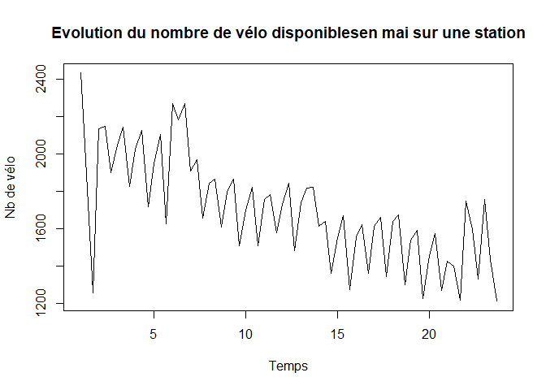
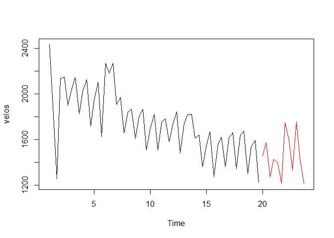
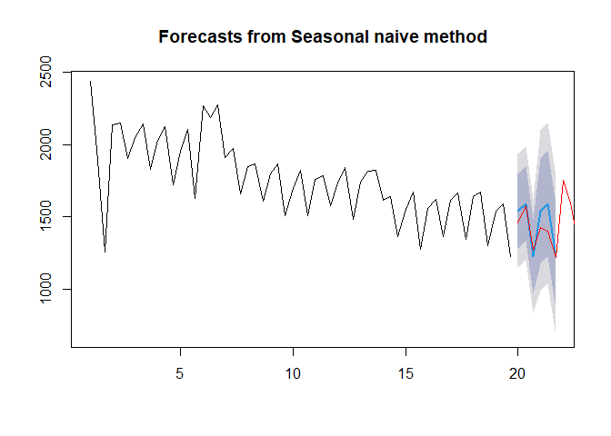
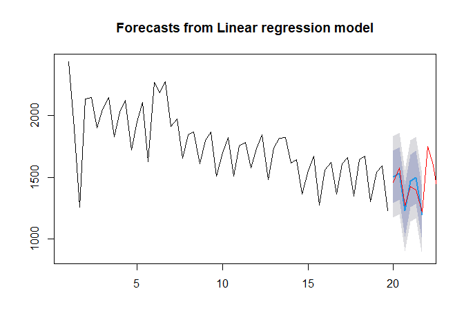
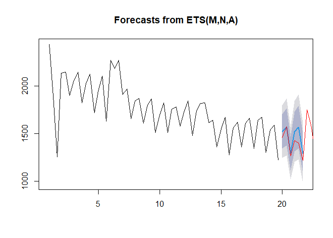

Vélo’v (Prédiction)
===================

Mots clés : *Vélo’v*, *Analyse de données temporelles*, *Prévision*

Technologie : [R](https://rstudio.com/)

L’objectif est d’anticiper le nombre de vélo disponibles sur une
station. Les données sont échantillonées à 8h, 12h et 18h les jours de
semaine du mois de mai 2019 sur une station Vélo’v à Lyon.

------------------------------------------------------------------------

Librairies
==========

    library(forecast) # fournit des fonctions de prévisions

    ## Warning: package 'forecast' was built under R version 4.0.5

    library(ggplot2)

    ## Warning: package 'ggplot2' was built under R version 4.0.5

Jeu de données Vélo’v
=====================

Les données
-----------

    c <- getwd() # répertoire local
    setwd(c)
    df <- read.csv("Data_Velov-May_2019filled.csv", sep=",", header=T) # chargement des données

La série de données est distribuée de manière saisonnière (1 saison =
1jour)

    velos <- ts(df$nb_velos_dispos,
                frequency=3) # convertion en time series (frequency=3 car 3 valeurs par jours)

    plot(velos, main="Evolution du nombre de vélo disponiblesen mai sur une station", xlab="Temps", ylab="Nb de vélo")

Découpage des données en 2 et visualisation :

    ech_calib <- window(velos, start = c(1,1), end = c(19,3)) # échantillon pour entraîner la prévision
    ech_eval <- window(velos, start = c(20,1)) # échantillon pour valier la prévision
    plot(velos, type = "n")
    lines(ech_calib)
    lines(ech_eval, col = "red")

**ech\_calib** sert à estimer les paramètres d’une méthode de prévision
et **ech\_eval** sert évaluer sa précision.

Fonctions prévisions
--------------------

### Méthode naïve saisonnière

    pred_snaive <- snaive(ech_calib, h=6) # h=6 pour prédire 6 nouvelles valeurs (2 jours/périodes)
    summary(pred_snaive)

    ## 
    ## Forecast method: Seasonal naive method
    ## 
    ## Model Information:
    ## Call: snaive(y = ech_calib, h = 6) 
    ## 
    ## Residual sd: 200.9443 
    ## 
    ## Error measures:
    ##                     ME     RMSE MAE       MPE     MAPE MASE       ACF1
    ## Training set -22.66667 200.9443 124 -1.831617 6.968142    1 0.09221677
    ## 
    ## Forecasts:
    ##          Point Forecast     Lo 80    Hi 80     Lo 95    Hi 95
    ## 20.00000           1542 1284.4795 1799.521 1148.1563 1935.844
    ## 20.33333           1591 1333.4795 1848.521 1197.1563 1984.844
    ## 20.66667           1227  969.4795 1484.521  833.1563 1620.844
    ## 21.00000           1542 1177.8110 1906.189  985.0209 2098.979
    ## 21.33333           1591 1226.8110 1955.189 1034.0209 2147.979
    ## 21.66667           1227  862.8110 1591.189  670.0209 1783.979

    plot(pred_snaive)
    lines(ech_eval, col = "red") # on affiche les vraies valeurs pour comparer avec la prévision

### Méthode régression linéaire multiple

    fit_lm <- tslm(ech_calib ~ trend + season)
    pred_lm <- forecast(fit_lm, h=6)
    summary(pred_lm)

    ## 
    ## Forecast method: Linear regression model
    ## 
    ## Model Information:
    ## 
    ## Call:
    ## tslm(formula = ech_calib ~ trend + season)
    ## 
    ## Coefficients:
    ## (Intercept)        trend      season2      season3  
    ##     2145.44       -11.07        40.81      -252.75  
    ## 
    ## 
    ## Error measures:
    ##                        ME     RMSE      MAE        MPE     MAPE      MASE
    ## Training set 7.976441e-15 150.0303 86.88585 -0.7174203 4.948897 0.7006924
    ##                   ACF1
    ## Training set 0.1820201
    ## 
    ## Forecasts:
    ##          Point Forecast     Lo 80    Hi 80     Lo 95    Hi 95
    ## 20.00000       1503.152 1290.3177 1715.986 1174.1995 1832.105
    ## 20.33333       1532.889 1320.0546 1745.723 1203.9363 1861.841
    ## 20.66667       1228.257 1015.4230 1441.092  899.3047 1557.210
    ## 21.00000       1469.930 1255.9231 1683.938 1139.1649 1800.696
    ## 21.33333       1499.667 1285.6600 1713.675 1168.9018 1830.433
    ## 21.66667       1195.036  981.0284 1409.043  864.2702 1525.801

    plot(pred_lm)
    lines(ech_eval, col = "red")

### Méthode lissage exponentielle

    fit_liss <- ets(ech_calib)
    pred_liss <- forecast(fit_liss, h=6)
    summary(pred_liss)

    ## 
    ## Forecast method: ETS(M,N,A)
    ## 
    ## Model Information:
    ## ETS(M,N,A) 
    ## 
    ## Call:
    ##  ets(y = ech_calib) 
    ## 
    ##   Smoothing parameters:
    ##     alpha = 0.3599 
    ##     gamma = 1e-04 
    ## 
    ##   Initial states:
    ##     l = 1979.4205 
    ##     s = -168.9396 108.2582 60.6814
    ## 
    ##   sigma:  0.0919
    ## 
    ##      AIC     AICc      BIC 
    ## 817.3099 818.9899 829.5682 
    ## 
    ## Error measures:
    ##                    ME     RMSE      MAE       MPE     MAPE      MASE
    ## Training set -25.2138 164.1862 110.5873 -2.235923 6.320136 0.8918327
    ##                     ACF1
    ## Training set -0.03819382
    ## 
    ## Forecasts:
    ##          Point Forecast    Lo 80    Hi 80     Lo 95    Hi 95
    ## 20.00000       1522.809 1343.418 1702.200 1248.4545 1797.164
    ## 20.33333       1570.358 1374.332 1766.384 1270.5624 1870.154
    ## 20.66667       1293.125 1114.555 1471.695 1020.0255 1566.224
    ## 21.00000       1522.809 1313.276 1732.342 1202.3563 1843.262
    ## 21.33333       1570.358 1346.391 1794.325 1227.8305 1912.886
    ## 21.66667       1293.125 1084.233 1502.016  973.6526 1612.597

    plot(pred_liss)
    lines(ech_eval, col="red")

Comparaison des modèles
-----------------------

Nous calculons les mesures de précision des prévisions pour cette
période.

Mesure de la qualité predictive :

    accuracy(pred_snaive, ech_eval) # méthode naïve saisonnière

    ##                     ME      RMSE       MAE       MPE     MAPE      MASE
    ## Training set -22.66667 200.94434 124.00000 -1.831617 6.968142 1.0000000
    ## Test set     -62.16667  98.93516  76.16667 -4.316637 5.419868 0.6142473
    ##                     ACF1 Theil's U
    ## Training set  0.09221677        NA
    ## Test set     -0.05015436 0.5941893

    accuracy(pred_lm, ech_eval) # méthode régression linéaire multiple

    ##                         ME      RMSE      MAE        MPE     MAPE      MASE
    ## Training set  7.976441e-15 150.03034 86.88585 -0.7174203 4.948897 0.7006924
    ## Test set     -1.365526e+01  54.16554 48.59464 -0.9076331 3.476938 0.3918923
    ##                     ACF1 Theil's U
    ## Training set  0.18202011        NA
    ## Test set     -0.05552066 0.3183611

    accuracy(pred_liss, ech_eval) # méthode lissage exponentielle

    ##                     ME      RMSE       MAE       MPE     MAPE      MASE
    ## Training set -25.21380 164.18621 110.58725 -2.235923 6.320136 0.8918327
    ## Test set     -70.93072  89.91843  72.14459 -5.182258 5.259378 0.5818112
    ##                     ACF1 Theil's U
    ## Training set -0.03819382        NA
    ## Test set      0.31365173 0.5491112

Conclusion
----------

Il ressort clairement que la méthode régression linéaire multiple est la
meilleure pour ces données. Le critère \*\*ME\* (=erreur moyenne) est le
plus faible pour cette méthode.
